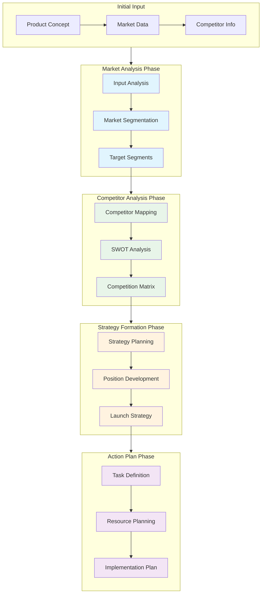

# Chain of Thought Prompting: A Multi-Phase Decision Making System

## Introduction

Chain of Thought (CoT) prompting is a powerful technique that guides AI systems through explicit reasoning steps. The example provided in the original prompt demonstrates this through a technical query analysis system. Let's explore this concept through a different lens: a Medical Diagnosis Support System.

## Table of Contents
- [Understanding CoT Principles](#understanding-cot-principles)
- [Multi-Phase System Example](#multi-phase-system-example)
- [Multi-Phase System Example 2](#multi-phase-system-example-2)
- [Implementing CoT in Practice](#implementing-cot-in-practice)
- [Analysis and Benefits](#analysis-and-benefits)
- [Core Benefits](#core-benefits)
- [Prototyping and Evolution](#prototyping-and-evolution)
- [Conclusion](#conclusion)

## Understanding CoT Principles

Chain of Thought prompting works by breaking down complex reasoning into explicit steps, much like how a doctor processes patient information. The key is not just reaching a conclusion, but documenting the thinking process that leads to it.
## Multi-Phase System Example
This example demonstrates how to chain prompts together to perform a comprehensive market analysis for a new product launch. Each phase's output becomes structured input for the next phase, creating a coherent analysis pipeline.

### Initial Input
```json
{
    "product": {
        "name": "EcoCharge",
        "category": "Consumer Electronics",
        "description": "Solar-powered smartphone charger with integrated battery",
        "target_price_range": "$49-79",
        "unique_features": ["Solar charging", "Weather resistant", "Compact design"]
    },
    "market_data": {
        "total_market_size": "$5.2B",
        "growth_rate": "12% YoY",
        "region": "North America"
    }
}
```

### Phase 1: Market Analysis

#### Prompt Template:
```
You are a Market Analysis Expert. Analyze the following product and market data to identify and segment potential markets. Focus on:
1. Customer segmentation based on needs and behaviors
2. Market size for each segment
3. Growth potential and trends

Input Data:
${phase1_input}

Provide output in the following structure:
{
    "segments": [],
    "total_addressable_market": {},
    "growth_metrics": {}
}
```

#### Output Example:
```json
{
    "segments": [
        {
            "name": "Eco-conscious Professionals",
            "size": "2.1M potential customers",
            "characteristics": ["Tech-savvy", "Environmentally conscious", "Urban"],
            "willingness_to_pay": "$65-85"
        },
        {
            "name": "Outdoor Enthusiasts",
            "size": "1.8M potential customers",
            "characteristics": ["Active lifestyle", "Adventure seekers", "Value durability"],
            "willingness_to_pay": "$70-100"
        }
    ],
    "total_addressable_market": {
        "size": "$245M",
        "growth_potential": "15% CAGR",
        "market_share_target": "5% by Year 2"
    }
}
```

### Phase 2: Competitor Analysis

#### Prompt Template:
```
You are a Competitive Intelligence Analyst. Using the market segmentation data and competitor information, perform a detailed competitive analysis.

Previous Phase Output: ${phase1_output}
Competitor Data: ${competitor_data}

Analyze:
1. Direct and indirect competitors
2. Competitive advantages and weaknesses
3. Market positioning opportunities

Structure the output as a competitive positioning matrix with SWOT analysis.
```

#### Output Example:
```json
{
    "competitive_landscape": {
        "direct_competitors": [
            {
                "name": "PowerBank Pro",
                "market_share": "15%",
                "key_strengths": ["Brand recognition", "Distribution channels"],
                "key_weaknesses": ["Higher price", "No solar option"]
            }
        ],
        "positioning_opportunities": [
            "Eco-friendly premium positioning",
            "Outdoor adventure market focus",
            "Urban professional convenience angle"
        ]
    },
    "swot_analysis": {
        "strengths": ["Unique solar feature", "Price point", "Design"],
        "weaknesses": ["New brand", "Limited distribution"],
        "opportunities": ["Growing eco-consciousness", "Outdoor market expansion"],
        "threats": ["Established competitors", "Technology changes"]
    }
}
```

### Phase 3: Strategy Formation

#### Prompt Template:
```
You are a Strategic Planning Expert. Based on the market segmentation and competitive analysis, develop a comprehensive launch strategy.

Market Analysis: ${phase1_output}
Competitive Analysis: ${phase2_output}

Design a launch strategy that:
1. Defines clear positioning
2. Outlines marketing channels
3. Sets pricing strategy
4. Establishes growth targets
```

#### Output Example:
```json
{
    "positioning_strategy": {
        "primary_message": "Sustainable power for the modern adventurer",
        "target_segments": ["Outdoor Enthusiasts", "Eco-conscious Professionals"],
        "value_proposition": "Premium eco-friendly portable power solution"
    },
    "go_to_market": {
        "launch_channels": [
            {
                "channel": "Direct to Consumer",
                "priority": "High",
                "timeline": "Month 0-3"
            },
            {
                "channel": "Outdoor Retail Partnerships",
                "priority": "Medium",
                "timeline": "Month 4-6"
            }
        ],
        "pricing_strategy": {
            "launch_price": "$69.99",
            "promotional_strategy": "Early bird discount for first 1000 units"
        }
    }
}
```

### Phase 4: Action Plan

#### Prompt Template:
```
You are a Project Implementation Specialist. Convert the launch strategy into an actionable implementation plan.

Strategy Document: ${phase3_output}

Create a detailed action plan including:
1. Timeline and milestones
2. Resource requirements
3. Budget allocation
4. Success metrics
```

#### Output Example:
```json
{
    "implementation_plan": {
        "phases": [
            {
                "name": "Pre-launch",
                "duration": "3 months",
                "key_tasks": [
                    "Website development",
                    "Marketing material creation",
                    "Influencer partnership setup"
                ],
                "budget": "$150,000"
            }
        ],
        "critical_milestones": [
            {
                "milestone": "Website Launch",
                "date": "Month 1, Week 4",
                "dependencies": ["Content creation", "E-commerce setup"]
            }
        ],
        "success_metrics": {
            "sales_targets": "1000 units in first month",
            "customer_acquisition_cost": "Max $35 per customer",
            "market_penetration": "2% in target segments by month 6"
        }
    }
}
```
## Multi-Phase System Example 2

Let's examine how a medical diagnosis system would implement CoT through multiple phases:

### Phase 1: Initial Data Collection
This phase serves as the information gathering foundation. Like a detective collecting evidence,
it focuses on assembling all relevant data points while maintaining objectivity and completeness.
The key is to gather information without jumping to conclusions.
```
THOUGHT PROCESS: "I need to gather all relevant patient information before making any assumptions."

INPUT: Patient presents with shortness of breath
ANALYSIS:
1. What type of breathing difficulty?
2. When did symptoms start?
3. Any related symptoms?
4. Patient history relevance?

OUTPUT: Structured patient data profile
```

### Phase 2: Symptom Pattern Recognition
This phase acts as a pattern matching engine. Think of it as a skilled art curator who can spot subtle connections between different pieces.
It processes raw data into meaningful patterns that can suggest possible pathways for investigation.
```
THOUGHT PROCESS: "Now that I have the data, I need to identify patterns that might suggest certain conditions."

INPUT: Structured patient data
ANALYSIS:
1. Compare against known symptom clusters
2. Consider seasonal factors
3. Evaluate demographic patterns
4. Check for common comorbidities

OUTPUT: Potential symptom patterns identified
```

### Phase 3: Differential Diagnosis
Working like a chess player evaluating possible moves, this phase weighs different possibilities against each other.
It considers not just what's most likely, but also what's most dangerous if missed.
```
THOUGHT PROCESS: "Based on the patterns, what are the possible conditions, from most to least likely?"

INPUT: Symptom patterns
ANALYSIS:
1. Rank conditions by probability
2. Consider exclusion criteria
3. Evaluate risk factors
4. Check for rare but critical conditions

OUTPUT: Ranked list of potential diagnoses
```

### Phase 4: Test Selection
Working like a chess player evaluating possible moves, this phase weighs different possibilities against each other.
It considers not just what's most likely, but also what's most dangerous if missed.
```
THOUGHT PROCESS: "Which tests would most efficiently confirm or rule out these possibilities?"

INPUT: Ranked diagnoses
ANALYSIS:
1. Consider test sensitivity/specificity
2. Evaluate cost-effectiveness
3. Account for patient factors
4. Prioritize critical conditions

OUTPUT: Recommended testing protocol
```

## Implementing CoT in Practice

The power of CoT lies in making each step explicit. Let's see how this works in a real scenario:

```
Patient Case:
"45-year-old female presenting with progressive shortness of breath over 3 days"

Phase 1 Thinking:
- First, I need to understand the progression pattern
- Must consider both acute and chronic causes
- Need to check for risk factors
- Important to note the timeframe is 3 days

Phase 2 Thinking:
- Progressive nature suggests non-emergency but concerning
- Three-day timeline rules out some chronic conditions
- Age and gender provide important context
- Need to consider common causes in this demographic

Phase 3 Thinking:
- Developing list of possibilities from most to least likely
- Considering severity indicators
- Evaluating need for immediate intervention
- Determining risk stratification

Phase 4 Thinking:
- Planning diagnostic approach
- Prioritizing tests based on severity and likelihood
- Considering cost and availability
- Preparing for possible outcomes
```
another CoT example, this time from a different domain - Aircraft Maintenance Troubleshooting using AI system:
```
Scenario: "Aircraft experiencing unusual vibration during cruise flight"

Phase 1 Thinking (Data Collection):
- First, need to characterize the vibration pattern
- Must document flight conditions when vibration occurs
- Important to review recent maintenance history
- Need to gather crew observations and sensor data

Phase 2 Thinking (Pattern Analysis):
- Vibration frequency suggests mechanical source
- Timing coincides with specific flight phase
- Pattern matches several known issues
- Environmental factors could be contributing

Phase 3 Thinking (Problem Identification):
- Creating hierarchical list of possible causes
- Evaluating component wear patterns
- Considering system interactions
- Assessing critical safety implications

Phase 4 Thinking (Action Planning):
- Developing inspection sequence
- Prioritizing critical components
- Planning necessary resources
- Preparing contingency procedures
```
another Multi-Phase System Example from Environmental Impact Assessment
```
ENVIRONMENTAL IMPACT ANALYSIS SYSTEM

Phase 1: Baseline Data Collection
THOUGHT PROCESS: "Must establish current environmental conditions before predicting changes"
- Gather existing environmental data
- Document current ecosystem status
- Measure key environmental indicators
- Record seasonal variations

Phase 2: Impact Prediction
THOUGHT PROCESS: "Need to model how proposed changes will affect each environmental component"
- Model direct effects
- Identify indirect impacts
- Consider cumulative effects
- Account for seasonal variations

Phase 3: Significance Assessment
THOUGHT PROCESS: "Must evaluate the importance and severity of each predicted impact"
- Rate impact severity
- Assess recovery potential
- Consider ecosystem resilience
- Evaluate long-term effects

Phase 4: Mitigation Planning
THOUGHT PROCESS: "Need to develop strategies to minimize or offset negative impacts"
- Design preventive measures
- Plan compensatory actions
- Develop monitoring protocols
- Create emergency responses
```

## Analysis

This multi-phase CoT approach offers several advantages:

1. **Transparency**: Each step of the reasoning process is visible and can be audited.

2. **Reliability**: By breaking down the thinking process, we reduce the chance of missing critical factors.

3. **Adaptability**: The system can be modified at any phase without disrupting the entire process.

4. **Learning Opportunity**: The explicit reasoning steps provide teaching moments for medical students.

Chain of Thought prompting serves as a powerful foundation for system prototyping and development, offering advantages that extend beyond immediate problem-solving.
Understanding these benefits helps us appreciate why CoT is particularly valuable in the early stages of desiging a system, where later every phase in the CoT be seperated
when needed into a seperate componenent that be part of a processing pipeline.

## Core Benefits

The multi-phase CoT approach provides several fundamental advantages that make it particularly suitable for system prototyping:

Transparency Through Process Visualization: By making each cognitive step explicit, CoT creates a natural blueprint for system architecture. This visibility helps stakeholders understand not just what decisions are made, but why they are made, creating a foundation for future system refinement.

Iterative Refinement Capability: The structured nature of CoT thinking allows for systematic improvement. Each phase can be enhanced independently, making it easier to evolve the system over time without complete redesigns. When we document our thinking process, we create natural breakpoints for future optimization.

Knowledge Transfer Framework: The explicit documentation of reasoning processes creates a bridge between human expertise and system implementation. This becomes particularly valuable when translating domain expert knowledge into systematic procedures that can be coded or automated.

## Prototyping and Evolution

CoT prompting excels as a prototyping tool because it naturally aligns with how complex systems evolve:

Natural Modularity: The step-by-step nature of CoT creates natural system boundaries. Each thinking phase can become a distinct module in the final system, making it easier to maintain and upgrade individual components.

Scalable Complexity: Starting with basic reasoning steps, systems can gradually incorporate more sophisticated logic. This scalability makes CoT an excellent foundation for systems that need to grow in complexity over time.

Validation Framework: The explicit reasoning steps provide natural checkpoints for validation. This makes it easier to identify where systems might fail and how they can be improved.

## Conclusion

Chain of Thought prompting represents more than just a method for breaking down complex problems—it serves as a powerful tool for prototyping and evolving sophisticated systems. By making thinking processes explicit, CoT creates a natural pathway from initial concept to full implementation.

The true power of CoT lies in its ability to bridge the gap between human reasoning and system design. As we've seen through various examples, this approach provides a framework that can grow with our understanding of the problem space. Whether we're designing medical diagnosis systems, environmental impact assessments, or any other complex decision-making system, CoT offers a structured way to start simple and evolve toward sophistication.

Looking forward, CoT prompting will likely play an increasingly important role in system design, particularly as we tackle more complex challenges that require transparent, auditable decision-making processes. The method's ability to capture and formalize expert thinking while maintaining flexibility for future enhancement makes it an invaluable tool in our system development toolkit.
