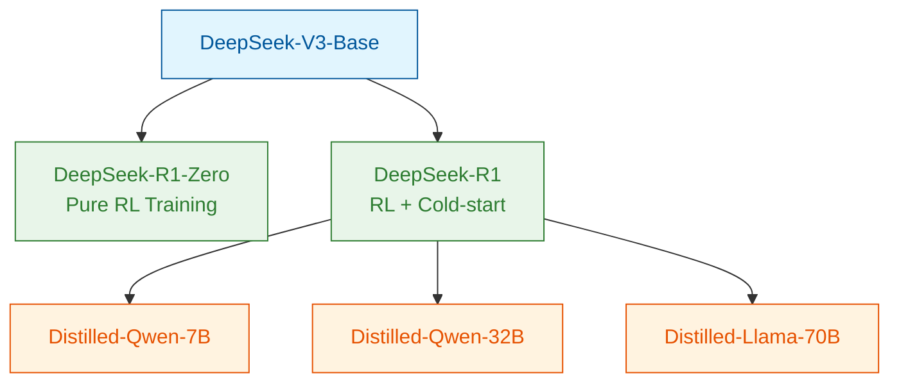
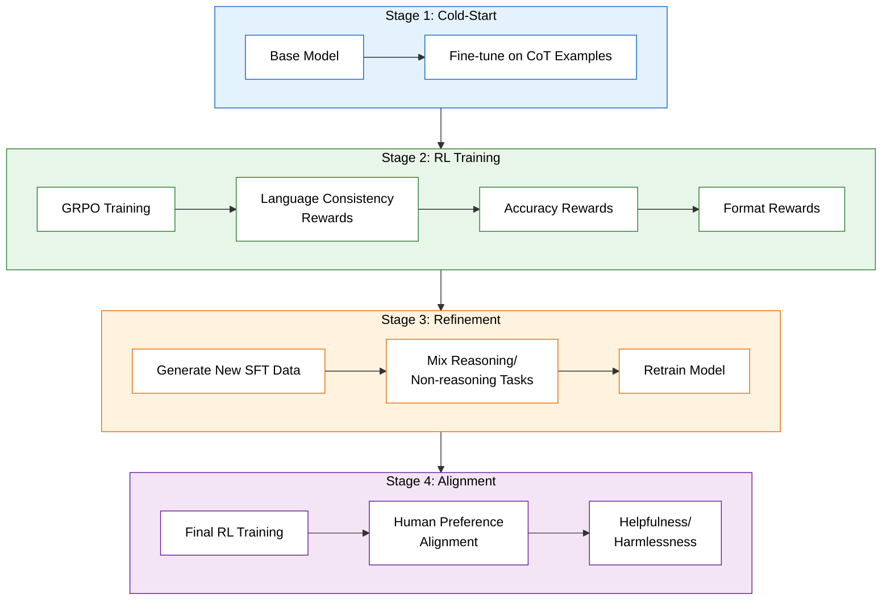
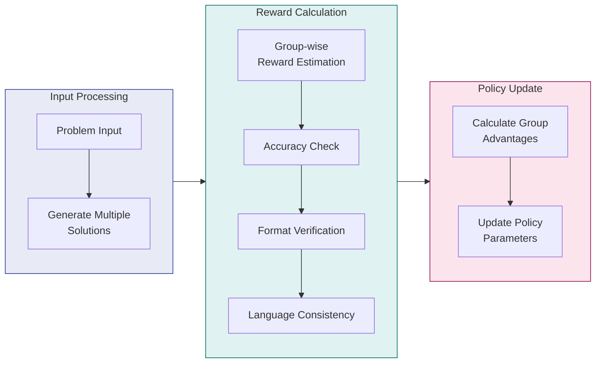

# Understanding DeepSeek-R1: A Breakthrough in AI Reasoning through Reinforcement Learning

## Table of Contents
1. [Introduction](#introduction)
2. [Core Contributions](#core-contributions)
3. [Methodology](#methodology)
4. [Results and Performance Analysis](#results-and-performance-analysis)
5. [Technical Challenges and Solutions](#technical-challenges-and-solutions)
6. [Limitations and Future Directions](#limitations-and-future-directions)
7. [Key Insights for ML Practitioners](#key-insights-for-ml-practitioners)
8. [Open Source Impact and Community Engagement](#open-source-impact)
9. [Conclusion](#conclusion)

---

## Introduction

The field of artificial intelligence has long sought to create systems capable of human-like reasoning. Traditional approaches often relied heavily on supervised learning and human-annotated data. The **DeepSeek-R1** paper presents a groundbreaking shift in this paradigm by demonstrating that **reinforcement learning (RL) alone** can develop sophisticated reasoning capabilities in large language models (LLMs). This innovative approach not only challenges our understanding of how AI systems learn to reason but also opens new possibilities for more efficient and scalable AI development.

DeepSeek-R1 introduces a novel framework that leverages RL to train models capable of complex reasoning tasks, such as mathematical problem-solving, coding challenges, and logical deduction. By eliminating the need for extensive supervised fine-tuning, this approach significantly reduces the dependency on human-labeled data, making AI development more scalable and cost-effective.

---

## Core Contributions

The research presents three distinct but interconnected models, each representing a significant advancement in AI reasoning capabilities. The **DeepSeek-R1-Zero** model stands as a pioneer in pure RL-based training, achieving remarkable reasoning abilities without any supervised fine-tuning. This is complemented by **DeepSeek-R1**, an enhanced version that combines RL with a minimal amount of supervised data through a cold-start approach, addressing the limitations of pure RL while maintaining its benefits.

Perhaps most importantly for practical applications, the research team successfully created a series of **distilled models** ranging from 1.5B to 70B parameters. These smaller models inherit the reasoning capabilities of their larger counterparts while remaining computationally efficient, making advanced AI reasoning more accessible to researchers and developers with limited resources.

### Key Innovations:
1. **Pure RL Training**: DeepSeek-R1-Zero is the first large language model trained purely through reinforcement learning, demonstrating that RL alone can incentivize the development of sophisticated reasoning capabilities.
2. **Cold-Start Approach**: DeepSeek-R1 combines RL with a minimal amount of supervised data, ensuring stability and readability while maintaining the benefits of RL.
3. **Knowledge Distillation**: The distilled models (1.5B to 70B parameters) inherit the reasoning capabilities of the larger models, making advanced AI reasoning accessible to a broader audience.

---

## Methodology

The training methodology represents a careful balance between innovation and practicality. The pure RL approach used in **DeepSeek-R1-Zero** demonstrates that reinforcement learning alone can incentivize the development of sophisticated reasoning capabilities, including self-verification behaviors and chain-of-thought reasoning.

The enhanced **DeepSeek-R1** introduces a multi-stage training pipeline that begins with a **cold-start phase** using high-quality Chain of Thought (CoT) examples. This is followed by reasoning-oriented RL training using the novel **Group Relative Policy Optimization (GRPO)** algorithm, which eliminates the need for a separate critic network while maintaining training effectiveness.

The knowledge distillation process involves generating **800,000 carefully selected training samples** from the main model, which are then used to train smaller, more efficient models. This process has proven remarkably effective, with even the 7B parameter model achieving impressive performance on complex reasoning tasks.

### Training Pipeline Overview:
1. **Cold-Start Phase**: Fine-tuning the base model on high-quality CoT examples to ensure initial stability and readability.
2. **RL Training**: Using GRPO to train the model with a combination of accuracy, format, and language consistency rewards.
3. **Refinement**: Generating new supervised fine-tuning (SFT) data and retraining the model on a mix of reasoning and non-reasoning tasks.
4. **Alignment**: Final RL training to align the model with human preferences, ensuring helpfulness and harmlessness.

---

## Results and Performance Analysis

The performance metrics across all model variants are remarkable. **DeepSeek-R1-Zero** achieves a **71.0% pass rate** on AIME 2024 in single attempts, rising to **86.7%** with majority voting. This represents a **4.5x improvement** over the base model. The enhanced **DeepSeek-R1** pushes these boundaries further, achieving **79.8% accuracy** on AIME 2024 and **97.3%** on MATH-500, while also excelling in coding tasks with a **2029 Elo rating** on Codeforces.

The distilled models demonstrate the effectiveness of knowledge transfer, with the **7B parameter model** achieving **55.5% accuracy** on AIME, surpassing much larger baselines. The **70B model** approaches the performance of OpenAI's mini models, suggesting that efficient knowledge distillation can maintain most of the reasoning capabilities while significantly reducing computational requirements.

### Key Performance Highlights:
- **DeepSeek-R1-Zero**:
  - AIME 2024: 71.0% single-attempt accuracy (4.5x base model)
  - With majority voting: 86.7% accuracy
- **DeepSeek-R1**:
  - AIME 2024: 79.8% accuracy
  - MATH-500: 97.3% accuracy
  - MMLU: 90.8% (exceeding GPT-4o)
  - Codeforces: 2029 Elo rating
- **Distilled Models**:
  - 7B model: 55.5% AIME accuracy (beats 32B baseline)
  - 70B model: Comparable to OpenAI-o1-mini

---

## Technical Challenges and Solutions

One of the most significant challenges faced in developing DeepSeek-R1 was managing readability in the pure RL model (**R1-Zero**). The team addressed this through an innovative **cold-start approach** using structured templates, ensuring that the model maintained coherent and readable outputs while preserving its reasoning capabilities.

The ever-present challenge of **reward hacking** in reinforcement learning was elegantly circumvented by avoiding neural reward models altogether. Instead, the team implemented **rule-based rewards** focusing on accuracy and formatting, providing clear and unambiguous signals for the learning process. This approach proved more stable and less prone to exploitation than traditional reward modeling.

**Language mixing**, a common issue in multilingual models, was effectively addressed through the introduction of **language consistency rewards** during the RL phase. This ensured that the model maintained linguistic coherence while switching between languages, particularly important for its English and Chinese capabilities.

The computational efficiency breakthrough came through the **GRPO mechanism**, which eliminated the need for separate critic networks while maintaining effective policy updates. This innovation significantly reduced the computational resources required for training while preserving performance.

### GRPO Mechanism:
1. **Input Processing**: The model generates multiple solutions for a given problem.
2. **Reward Calculation**: Group-wise reward estimation based on accuracy, format, and language consistency.
3. **Policy Update**: The model updates its parameters based on the calculated group advantages.

---

## Limitations and Future Directions

Despite its impressive achievements, **DeepSeek-R1** faces several notable limitations. The model shows some lag in **general capabilities** compared to base models, particularly in tasks like role-playing and structured JSON output. This suggests that while specialized reasoning capabilities can be enhanced through RL, maintaining broad general capabilities requires careful balance.

**Language support** remains primarily optimized for Chinese and English, with other languages showing notably weaker performance. This limitation reflects the broader challenge in multilingual AI development and highlights an important area for future research.

The model's **sensitivity to prompt structure**, performing better with zero-shot prompts than few-shot examples, indicates that there's still work to be done in making the system more robust to varying input formats. Future research directions point toward expanding these capabilities, particularly in **software engineering tasks** and broader **multilingual support**.

### Key Limitations:
1. **General Capabilities**:
   - Lags behind base models in role-playing, JSON output, etc.
   - Struggles with tasks outside its specialized reasoning domain.
2. **Language Constraints**:
   - Optimized for Chinese and English.
   - Struggles with other languages, limiting global applicability.
3. **Prompt Sensitivity**:
   - Zero-shot prompts work best.
   - Few-shot prompts degrade performance, indicating room for improvement in generalization.

### Future Directions:
1. **Scaling to Software Engineering Tasks**:
   - Extend reasoning capabilities to complex software development tasks.
   - Improve performance on coding challenges and debugging.
2. **Improving Multilingual Support**:
   - Expand language capabilities beyond Chinese and English.
   - Develop more robust multilingual reasoning frameworks.
3. **Enhancing General Capabilities**:
   - Balance specialized reasoning with broader general-purpose performance.
   - Improve role-playing and structured output generation.

---

## Key Insights for ML Practitioners

For machine learning practitioners, this research offers several valuable insights. First, it demonstrates that **pure reinforcement learning** can effectively develop sophisticated reasoning capabilities, challenging the conventional wisdom that extensive supervised fine-tuning is necessary. This opens new possibilities for training approaches that require less human-annotated data.

The success of the **cold-start approach** provides practical guidance for addressing stability issues in RL training. By using a minimal amount of high-quality supervised data as a starting point, practitioners can achieve more stable training while maintaining the benefits of reinforcement learning.

The effectiveness of **knowledge distillation** in transferring reasoning capabilities to smaller models offers a practical pathway for deploying advanced AI capabilities in resource-constrained environments. This is particularly relevant for practitioners working with limited computational resources.

### Key Takeaways:
1. **RL Can Incentivize Reasoning**:
   - Pure RL (without SFT) can unlock chain-of-thought (CoT), reflection, and problem-solving skills.
2. **Cold-Start Data Matters**:
   - Minimal SFT data resolves RL instability and readability issues.
3. **Distillation > RL for Small Models**:
   - Smaller models benefit more from distilled reasoning patterns than standalone RL.
4. **Benchmarking**:
   - Use **pass@k** (not greedy decoding) for reliable evaluation of reasoning tasks.

---

## Open Source Impact and Community Engagement

The release of **DeepSeek-R1-Zero**, **DeepSeek-R1**, and **six distilled models** (ranging from 1.5B to 70B parameters) represents a significant contribution to the open-source AI community. By making these models publicly available, the research team enables broader experimentation and advancement in RL-driven reasoning capabilities.

### Open-Source Contributions:
1. **Model Releases**:
   - DeepSeek-R1-Zero: Pure RL-trained model.
   - DeepSeek-R1: Enhanced RL + cold-start model.
   - Distilled Models: 1.5B, 7B, 32B, and 70B variants.
2. **Community Engagement**:
   - Encourages researchers to explore RL-driven reasoning.
   - Provides benchmarks and baselines for future work.
3. **Practical Applications**:
   - Enables developers to integrate advanced reasoning capabilities into their applications.
   - Reduces the barrier to entry for AI research and development.

For implementation details, refer to the paper’s [GitHub repository](https://github.com/deepseek-ai/deepseek-r1) or experiment with the released checkpoints.

---

## Conclusion

The **DeepSeek-R1** paper represents a significant milestone in AI development, demonstrating that **reinforcement learning** can effectively drive the development of reasoning capabilities in language models. The success of both pure RL training and hybrid approaches, combined with effective knowledge distillation, opens new pathways for developing more efficient and capable AI systems.

The research not only advances our understanding of how AI systems can learn to reason but also provides practical solutions for deploying these capabilities in real-world applications. The open-source release of multiple model variants ensures that these advances can benefit the broader AI research community.

As we look to the future, the limitations identified in this work provide clear directions for further research, particularly in expanding language support and general capabilities. The success of the **GRPO mechanism** and knowledge distillation approaches suggests that we may see even more efficient training methods emerge, potentially democratizing access to advanced AI reasoning capabilities.

The insights gained from this research will likely influence the development of future AI systems, particularly in approaches to combining reinforcement learning with other training methods and in making advanced AI capabilities more accessible through efficient model distillation.

---

### References
https://arxiv.org/abs/2501.12948

