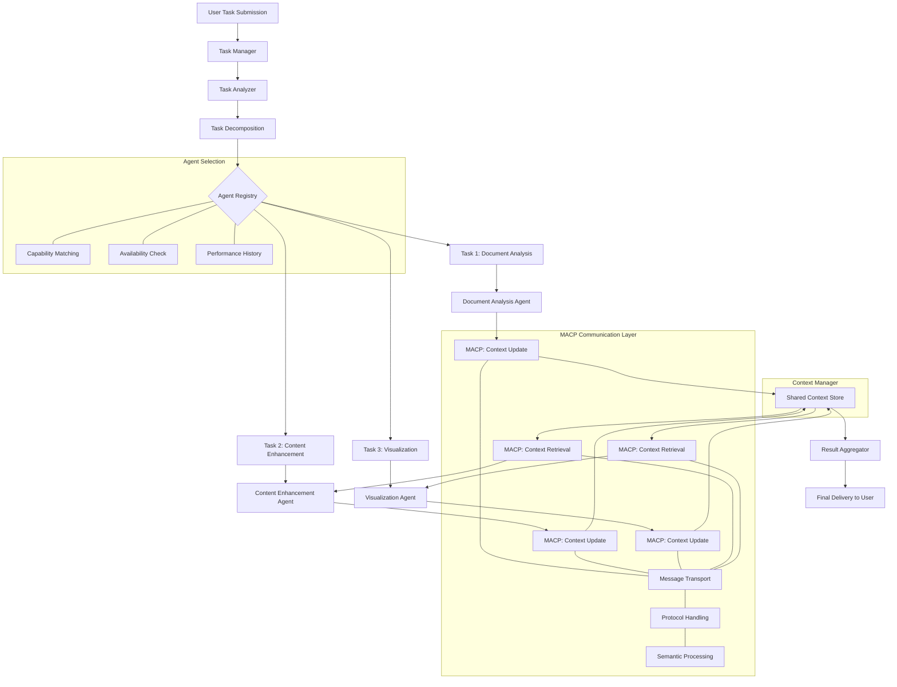
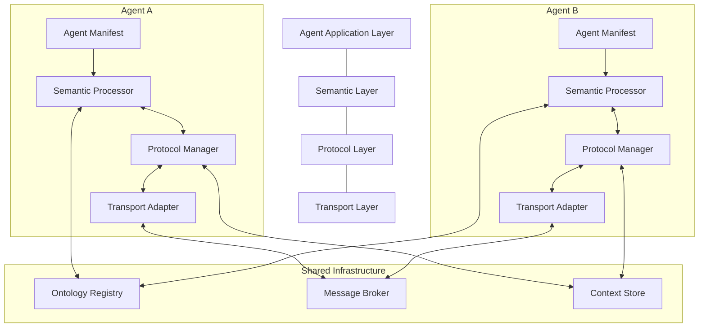
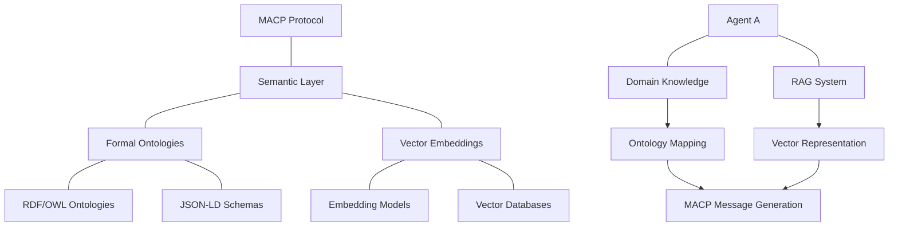
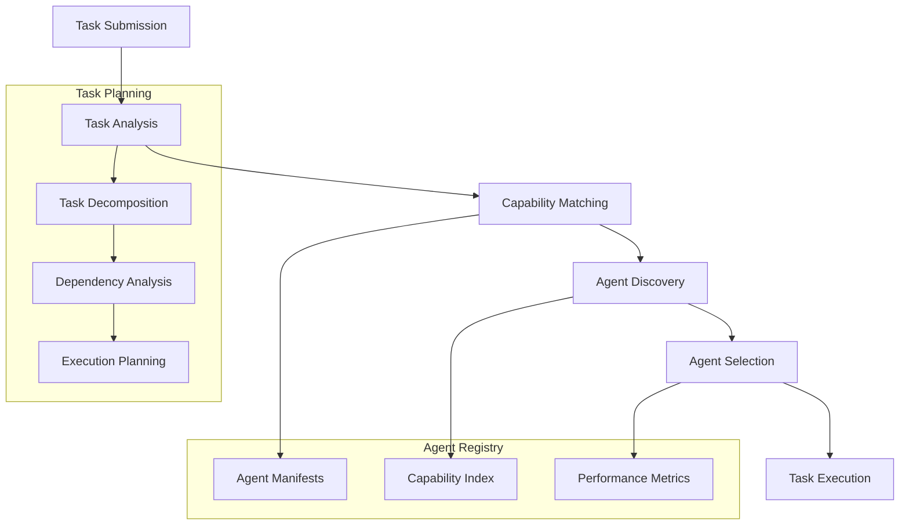
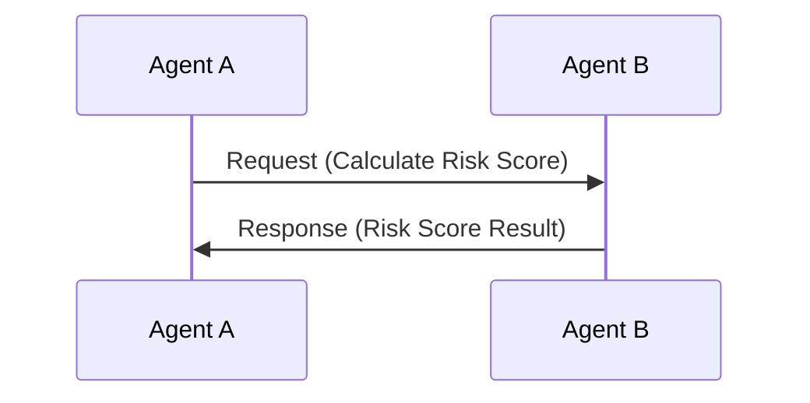
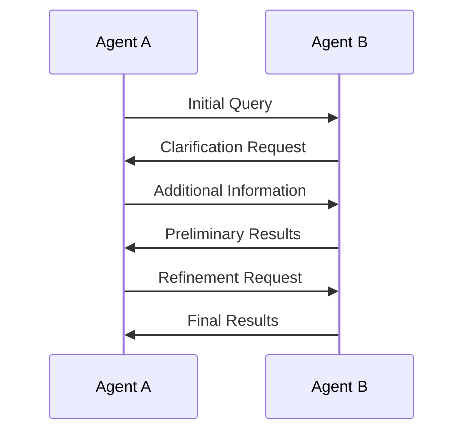
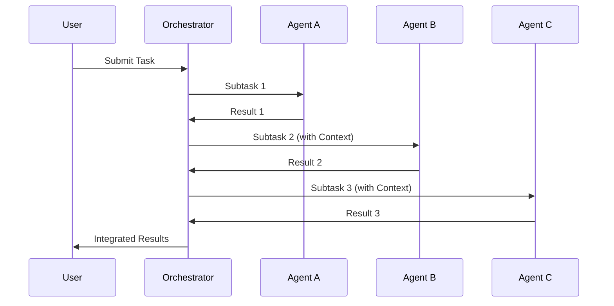
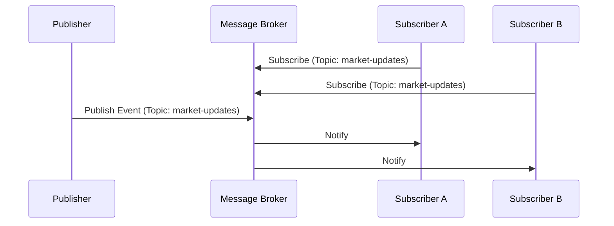
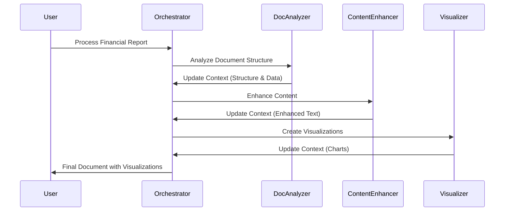

# Modern Agent Communication Protocol (MACP): A Guide Draft

## Introduction: The Next Evolution in Agent Communication

In an increasingly complex AI ecosystem, the need for sophisticated agent-to-agent communication such as Agent2Agent protocol and MCP for tool use has never been more critical.
The Modern Agent Communication Protocol (MACP) represents a significant advancement in how AI agent systems interact, collaborate, and solve problems together. While historical approaches like FIPA-ACL (Foundation for Intelligent Physical Agents - Agent Communication Language) provided initial frameworks for agent communication, today's AI landscape demands a more robust, semantic, and context-aware approach.

MACP is designed from first principles to enable rich, meaningful interactions between diverse agents operating across distributed environments. It addresses the fundamental challenge of enabling specialized AI systems to work together seamlessly while preserving context, managing state, and supporting complex collaborative workflows.

This article introduces the MACP draft(V0.1) specification, its theoretical foundations, core architecture, and practical implementation considerations. Our goal is to provide a comprehensive guide for developers, researchers, and system architects looking to build interoperable agent systems.


## Theoretical Foundations: Language Design Features for Agent Communication

### Hockett's Design Features Applied to Agent Communication

In 1960, linguist Charles Hockett identified distinctive features that characterize human language. These features provide a valuable framework for designing agent communication protocols. MACP adapts these principles to create a communication system that mirrors the expressiveness, flexibility, and power of human language:

| Hockett's Feature | How MACP Implements It |
|-------------------|------------------------|
| **Arbitrariness** | MACP supports flexible mapping between symbols and meanings through extensible ontologies. While protocols often use predefined terms, MACP allows agents to negotiate meaning. |
| **Discreteness** | Messages consist of well-defined, discrete components (envelope, context, content) with clear boundaries and structure. |
| **Duality of Patterning** | Basic data units (bytes, tokens) combine to form meaningful structures (JSON objects, ontology concepts) which further combine into complete messages. |
| **Productivity** | The protocol enables unlimited novel message construction through flexible schemas, content types, and semantic structures. |
| **Displacement** | MACP explicitly supports references to past, future, or hypothetical states through temporal markers, conversation histories, and context references. |
| **Semanticity** | Rich semantic layers connect message content to formal ontologies, ensuring consistent interpretation across diverse agents. |
| **Cultural Transmission** | Agents can learn from interactions and evolve their understanding through adaptive mechanisms and ontology sharing. |
| **Interchangeability** | Any agent can function as both sender and receiver, with message expectations clearly defined for responses. |
| **Reflexivity** | The protocol supports meta-communication, allowing agents to discuss, negotiate, and refine the communication process itself. |

### Modern Communication Principles

Beyond Hockett's features, MACP incorporates contemporary principles essential for distributed systems:

1. **Context Preservation**: Maintaining shared understanding as tasks move between agents
2. **Semantic Interoperability**: Ensuring consistent meaning interpretation across diverse implementations
3. **Capability Discovery**: Allowing agents to find and utilize each other's specialized skills
4. **State Management**: Tracking progress and maintaining consistency across distributed operations
5. **Security and Trust**: Verifying identity and ensuring appropriate access to sensitive information

## MACP Core Architecture: A Layered Approach

MACP implements a layered architecture that separates concerns while providing a coherent framework for agent interaction:



### 1. Transport Layer

The foundation of MACP is a flexible transport layer that enables communication across various network infrastructures:

- **Multi-protocol Support**: Works over HTTP/REST, WebSockets, MQTT, gRPC, and other protocols
- **Synchronous and Asynchronous Communication**: Supports both request-response and publish-subscribe patterns
- **Reliability Mechanisms**: Ensures message delivery with acknowledgments, retries, and idempotency
- **Security**: Implements TLS, authentication, and authorization at the transport level

### 2. Protocol Layer

The protocol layer handles message structure, routing, and lifecycle management:

- **Standardized Message Format**: Defines the envelope structure and metadata
- **Conversation Management**: Tracks related messages as part of coherent interactions
- **Message Routing**: Directs messages to appropriate agents based on capabilities and context
- **State Tracking**: Maintains the state of ongoing interactions across multiple exchanges

### 3. Semantic Layer

The semantic layer ensures consistent meaning interpretation across diverse agents:

- **Ontology Integration**: Links message content to shared conceptual frameworks
- **Content Validation**: Ensures messages conform to expected schemas and semantics
- **Context Management**: Maintains shared understanding across conversation lifetime
- **Reasoning Support**: Enables inference about message content and implications

### 4. Agent Application Layer

The application layer is where agent-specific logic resides:

- **Capability Exposure**: Defines and publishes agent capabilities via manifests
- **Task Processing**: Handles domain-specific operations and actions
- **Decision Making**: Determines appropriate responses to received messages
- **Collaboration Logic**: Manages participation in multi-agent workflows

## Message Structure: The Building Blocks of Agent Communication

The MACP message structure provides rich expressiveness while maintaining clarity and structure:

```mermaid
flowchart TB
    M[MACP Message] --> E[Envelope Layer]
    M --> C[Context Layer]
    M --> P[Performative Layer]
    M --> CT[Content Layer]
    M --> S[Semantic Layer]
    M --> EX[Expectations Layer]
    
    %% Envelope Layer
    E --> E1[Message ID]
    E --> E2[Timestamp]
    E --> E3[Protocol Version]
    E --> E4[Priority]
    E --> E5[Message Trace]
    
    %% Context Layer
    C --> C1[Conversation Context]
    C1 --> C1A[Conversation ID]
    C1 --> C1B[Conversation State]
    C1 --> C1C[History Reference]
    
    C --> C2[References]
    C2 --> C2A[Previous Messages]
    C2 --> C2B[External Resources]
    
    C --> C3[Temporal Context]
    C3 --> C3A[Valid From/Until]
    C3 --> C3B[Response Deadlines]
    
    %% Performative Layer
    P --> P1[Type]
    P1 --> P1A[request]
    P1 --> P1B[inform]
    P1 --> P1C[query]
    P1 --> P1D[propose]
    
    P --> P2[Subtype]
    P --> P3[Strength]
    
    P --> P4[Conditions]
    P4 --> P4A[Preconditions]
    P4 --> P4B[Postconditions]
    
    %% Content Layer
    CT --> CT1[Format]
    CT --> CT2[Schema URI]
    CT --> CT3[Data Payload]
    CT --> CT4[Encoding]
    
    %% Semantic Layer
    S --> S1[Ontology Reference]
    
    S --> S2[Concepts]
    S2 --> S2A[Concept URIs]
    S2 --> S2B[Confidence Scores]
    
    S --> S3[Relations]
    S3 --> S3A[Subject-Predicate-Object]
    
    S --> S4[Interpretation Rules]
    
    %% Expectations Layer
    EX --> EX1[Response Format]
    EX1 --> EX1A[Required Elements]
    EX1 --> EX1B[Deadlines]
    
    EX --> EX2[Processing Preferences]
    EX2 --> EX2A[Parallelism]
    EX2 --> EX2B[Fallback Strategies]
    
    EX --> EX3[Quality Requirements]
    EX3 --> EX3A[Confidence Thresholds]
    EX3 --> EX3B[Precision Levels]
```

### Envelope: Core Metadata

```json
"envelope": {
  "id": "msg-12345-67890",
  "timestamp": "2025-04-14T10:23:45Z",
  "protocol_version": "macp/1.1",
  "ttl": "30s",
  "priority": "normal",
  "trace": [
    {"hop": "agent-A", "time": "2025-04-14T10:23:45.123Z", "action": "sent"},
    {"hop": "message-broker", "time": "2025-04-14T10:23:45.198Z", "action": "routed"}
  ]
}
```

### Context: Communication Environment

```json
"context": {
  "conversation": {
    "id": "conv-7890",
    "state": "active",
    "history_ref": "conv:7890/messages",
    "current_focus": {
      "topic": "risk_analysis",
      "timeframe": "Q2_2025"
    }
  },
  "references": [
    {
      "type": "previous_message",
      "id": "msg-12344",
      "relation": "responds_to"
    },
    {
      "type": "external_resource",
      "uri": "https://data.example.com/stocks/2025",
      "relation": "references"
    }
  ],
  "temporal": {
    "valid_from": "2025-04-14T00:00:00Z",
    "valid_until": "2025-04-15T00:00:00Z",
    "response_expected_by": "2025-04-14T12:30:00Z"
  }
}
```

### Performative: Communication Intent

```json
"performative": {
  "type": "request",
  "subtype": "compute_analysis",
  "strength": "obligatory",
  "conditions": [
    {"type": "precondition", "constraint": "data_available"},
    {"type": "postcondition", "expectation": "analysis_complete"}
  ]
}
```

### Content: Message Payload

```json
"content": {
  "format": "application/json",
  "schema_uri": "https://schemas.example.com/financial/v2#Analysis",
  "data": {
    "portfolio_id": "port-123",
    "analysis_type": "risk",
    "parameters": {
      "time_horizon": "6m",
      "confidence_interval": 0.95
    }
  },
  "encoding": {
    "compression": "gzip",
    "encryption": "none"
  }
}
```

### Semantic: Meaning Layer

```json
"semantic": {
  "ontology": "https://ontology.example.com/finance/v3",
  "concepts": [
    {"uri": "fin:Analysis", "confidence": 0.95},
    {"uri": "fin:MarketRisk", "confidence": 0.87}
  ],
  "relations": [
    {
      "subject": "fin:Analysis",
      "predicate": "fin:analyzes",
      "object": "fin:MarketRisk"
    }
  ],
  "interpretation_rules": [
    "rule:temporal_context_required",
    "rule:multiple_entities_allowed"
  ]
}
```

### Expectations: Response Guidelines

```json
"expectations": {
  "response": {
    "format": "application/json",
    "required_elements": ["analysis_result", "confidence_score"],
    "max_size": "1MB",
    "deadline": "5s"
  },
  "processing": {
    "parallel_allowed": true,
    "idempotent": false,
    "fallback_strategy": "approximate_results"
  },
  "quality": {
    "min_confidence": 0.8,
    "precision_level": "high"
  }
}
```

## The Role of Ontologies in MACP: Semantic Foundation

One of MACP's most powerful features is its integration of formal ontologies to enable semantic understanding between agents. Unlike earlier protocols that focused primarily on syntax, MACP emphasizes meaning through shared conceptual frameworks.

### Ontologies vs. RAG: Complementary Approaches
```mermaid
flowchart TD
    A[Agent Communication] --> B{Knowledge Representation}
    
    B --> C[Ontology-Based Approach]
    B --> D[RAG-Based Approach]
    
    subgraph "Formal Ontologies"
        C1[Explicit Concept Hierarchies]
        C2[Formal Relationships]
        C3[Inference Rules]
        C --> C1
        C --> C2
        C --> C3
        
        C1A[OWL/RDF Ontologies]
        C1B[JSON-LD Schemas]
        C1 --> C1A
        C1 --> C1B
        
        C2A[is-a Relationships]
        C2B[has-a Relationships]
        C2C[Domain-Specific Relations]
        C2 --> C2A
        C2 --> C2B
        C2 --> C2C
        
        C3A[Deductive Rules]
        C3B[Constraint Rules]
        C3 --> C3A
        C3 --> C3B
    end
    
    subgraph "RAG Systems"
        D1[Vector Embeddings]
        D2[Retrieval Mechanisms]
        D3[Generation Models]
        D --> D1
        D --> D2
        D --> D3
        
        D1A[Text Embeddings]
        D1B[Multimodal Embeddings]
        D1 --> D1A
        D1 --> D1B
        
        D2A[Semantic Search]
        D2B[Hybrid Retrieval]
        D2 --> D2A
        D2 --> D2B
        
        D3A[LLM Generation]
        D3B[Task-Specific Generation]
        D3 --> D3A
        D3 --> D3B
    end
    
    C --> E[MACP Semantic Layer]
    D --> E
    
    E --> F[Agent A Understanding]
    E --> G[Agent B Understanding]
    
    subgraph "Hybrid Approach"
        E1[Formal Semantics]
        E2[Semantic Similarity]
        E3[Context Integration]
        E --> E1
        E --> E2
        E --> E3
        
        E1A[Ontology References]
        E1B[Concept Mappings]
        E1 --> E1A
        E1 --> E1B
        
        E2A[Embedding-Based Matching]
        E2B[Fuzzy Matching]
        E2 --> E2A
        E2 --> E2B
        
        E3A[Context Preservation]
        E3B[Knowledge Integration]
        E3 --> E3A
        E3 --> E3B
    endflowchart TD
    A[Agent Communication] --> B{Knowledge Representation}
    
    B --> C[Ontology-Based Approach]
    B --> D[RAG-Based Approach]
    
    subgraph "Formal Ontologies"
        C1[Explicit Concept Hierarchies]
        C2[Formal Relationships]
        C3[Inference Rules]
        C --> C1
        C --> C2
        C --> C3
        
        C1A[OWL/RDF Ontologies]
        C1B[JSON-LD Schemas]
        C1 --> C1A
        C1 --> C1B
        
        C2A[is-a Relationships]
        C2B[has-a Relationships]
        C2C[Domain-Specific Relations]
        C2 --> C2A
        C2 --> C2B
        C2 --> C2C
        
        C3A[Deductive Rules]
        C3B[Constraint Rules]
        C3 --> C3A
        C3 --> C3B
    end
    
    subgraph "RAG Systems"
        D1[Vector Embeddings]
        D2[Retrieval Mechanisms]
        D3[Generation Models]
        D --> D1
        D --> D2
        D --> D3
        
        D1A[Text Embeddings]
        D1B[Multimodal Embeddings]
        D1 --> D1A
        D1 --> D1B
        
        D2A[Semantic Search]
        D2B[Hybrid Retrieval]
        D2 --> D2A
        D2 --> D2B
        
        D3A[LLM Generation]
        D3B[Task-Specific Generation]
        D3 --> D3A
        D3 --> D3B
    end
    
    C --> E[MACP Semantic Layer]
    D --> E
    
    E --> F[Agent A Understanding]
    E --> G[Agent B Understanding]
    
    subgraph "Hybrid Approach"
        E1[Formal Semantics]
        E2[Semantic Similarity]
        E3[Context Integration]
        E --> E1
        E --> E2
        E --> E3
        
        E1A[Ontology References]
        E1B[Concept Mappings]
        E1 --> E1A
        E1 --> E1B
        
        E2A[Embedding-Based Matching]
        E2B[Fuzzy Matching]
        E2 --> E2A
        E2 --> E2B
        
        E3A[Context Preservation]
        E3B[Knowledge Integration]
        E3 --> E3A
        E3 --> E3B
    end
```
Retrieval Augmented Generation (RAG) and ontology-based semantic systems represent different but complementary approaches to knowledge representation:

| Aspect | Ontology-Based Approach | RAG Approach |
|--------|-------------------------|-------------|
| **Structure** | Formal, explicit representation of concepts and relationships | Implicit knowledge embedded in vector embeddings |
| **Reasoning** | Supports logical inference and rule-based reasoning | Relies on statistical similarity and pattern recognition |
| **Precision** | High precision for well-defined domains | Better handling of ambiguity and nuance |
| **Flexibility** | Requires explicit modeling of knowledge | Can work with unstructured information |
| **Scalability** | Challenging to scale to very broad domains | Scales well across diverse knowledge |
| **Interoperability** | Strong support for system-to-system communication | Better for human-AI interaction |

MACP leverages the strengths of ontology-based approaches for agent-to-agent communication while remaining compatible with RAG systems:



### Ontology Implementation in MACP

MACP shall supports multiple approaches to ontology implementation:

1. **Formal Ontologies**: Using standards like OWL, RDF, or JSON-LD to define explicit concept hierarchies and relationships

2. **Lightweight Schemas**: Simpler JSON Schema definitions with semantic annotations

3. **Hybrid Approaches**: Combining formal ontologies with vector embeddings to balance structure and flexibility

The semantic layer in MACP supports:

- **Ontology Discovery**: Finding appropriate ontologies for specific domains
- **Semantic Mapping**: Translating between different ontological frameworks
- **Semantic Validation**: Ensuring message content conforms to expected semantics
- **Semantic Enrichment**: Adding contextual knowledge to basic content

### Practical Example: Financial Domain Communication

An agent communication about financial risk analysis using MACP's semantic layer:

```json
{
  "semantic": {
    "ontology": "https://ontology.example.com/finance/v3",
    "concepts": [
      {"uri": "fin:Portfolio", "confidence": 1.0},
      {"uri": "fin:RiskAnalysis", "confidence": 0.98},
      {"uri": "fin:VolatilityMeasure", "confidence": 0.95}
    ],
    "relations": [
      {
        "subject": "fin:RiskAnalysis",
        "predicate": "fin:analyzesRiskOf",
        "object": "fin:Portfolio"
      },
      {
        "subject": "fin:RiskAnalysis",
        "predicate": "fin:usesMeasure",
        "object": "fin:VolatilityMeasure"
      }
    ],
    "context_requirements": {
      "temporal_scope": "required",
      "market_conditions": "if_available"
    }
  }
}
```

This semantic annotation ensures that the receiving agent understands not just the data structure, but the meaning of the request, relationships between concepts, and contextual requirements.

## Integration with Agent Manifests: Dynamic Discovery and Orchestration

MACP integrates seamlessly with agent manifest systems, enabling dynamic discovery and capability-based routing:

### Enhanced Agent Manifests with Communication Capabilities

Agent manifests describe what an agent can do and how it can be used. MACP extends this with rich communication specifications:

```json
{
  "name": "Financial Analysis Agent",
  "slug": "financial-analysis",
  "version": "2.1.0",
  "description": "Analyzes financial data and generates reports",
  "baseUrl": "https://agents.example.com/financial",
  
  "capabilities": [
    {
      "skill_path": ["Finance", "Risk Analysis"],
      "metadata": {
        "supported_markets": ["Equities", "Bonds", "Commodities"],
        "analysis_types": ["Trend", "Volatility", "Correlation"]
      }
    }
  ],
  
  "communication": {
    "protocols": {
      "default": "macp/1.1",
      "supported": [
        {
          "name": "macp",
          "versions": ["1.1", "1.0"],
          "features": ["streaming", "compression", "semantic_routing"]
        }
      ]
    },
    
    "channels": {
      "main": {
        "type": "request_response",
        "encoding": "json",
        "path": "/communication/request"
      },
      "events": {
        "type": "pubsub",
        "topics": ["/analysis/updates", "/system/status"],
        "subscription_path": "/communication/subscribe"
      }
    },
    
    "semantic_profile": {
      "ontologies": [
        {
          "uri": "https://ontology.example.com/finance/v3",
          "preferred": true
        }
      ],
      "context_models": ["temporal", "market_conditions"],
      "reasoning_capabilities": ["deductive", "probabilistic"]
    }
  }
}
```

### Dynamic Capability-Based Routing

MACP enables intelligent task routing based on agent capabilities:



This process enables sophisticated multi-agent workflows where:

1. Complex tasks are broken down into subtasks
2. Each subtask is matched to agent capabilities
3. Appropriate agents are discovered and selected
4. Tasks are executed in the optimal sequence
5. Results are aggregated and context is maintained throughout

### Context Management Across Agent Boundaries

A key innovation in MACP is its sophisticated context management, ensuring knowledge is preserved as tasks move between agents:

```json
{
  "context_id": "ctx-7812",
  "task_description": "Process quarterly financial report",
  "document": {
    "type": "financial_report",
    "title": "Q2 2025 Financial Summary",
    "content": "...",
    "raw_data_tables": [
      {"title": "Revenue by Division", "data": [...]}
    ]
  },
  "processing_history": [
    {
      "step": "document_analysis",
      "agent": "document_analysis_agent",
      "timestamp": "2025-04-14T09:15:23Z",
      "additions": ["document_structure", "key_metrics", "data_tables"]
    },
    {
      "step": "content_enhancement",
      "agent": "content_enhancement_agent",
      "timestamp": "2025-04-14T09:17:45Z",
      "additions": ["enhanced_sections", "grammar_fixes", "clarity_improvements"]
    }
  ]
}
```

## Implementation Patterns: From Theory to Practice

MACP supports various communication patterns reflecting different collaborative needs:

### 1. Simple Request-Response

The most basic pattern, suitable for atomic information exchanges or service requests:



### 2. Conversational Dialogue

A back-and-forth pattern for iterative problem-solving or information gathering:



### 3. Multi-Agent Collaboration

Complex workflows involving multiple specialized agents:



### 4. Publish-Subscribe

Event-driven communication for monitoring and reactive behaviors:



### Example: Document Processing Multi-Agent System

A concrete implementation of MACP in a document processing workflow:



#### MACP Message Examples for Document Processing

**Step 1: Initial Request to Document Analyzer**

```json
{
  "envelope": {
    "id": "msg-1001",
    "timestamp": "2025-04-14T09:15:00Z",
    "protocol_version": "macp/1.1"
  },
  "performative": {
    "type": "request",
    "subtype": "analyze-document"
  },
  "content": {
    "format": "application/json",
    "data": {
      "document_type": "financial_report",
      "operation": "extract_structure_and_data"
    }
  },
  "context": {
    "conversation": {
      "id": "conv-5001",
      "state": "active"
    }
  },
  "expectations": {
    "response": {
      "required_elements": ["document_structure", "key_metrics", "data_tables"]
    }
  }
}
```

**Step 2: Context Update After Document Analysis**

```json
{
  "envelope": {
    "id": "msg-1002",
    "timestamp": "2025-04-14T09:15:30Z",
    "protocol_version": "macp/1.1"
  },
  "performative": {
    "type": "inform",
    "subtype": "context-update"
  },
  "content": {
    "format": "application/json",
    "data": {
      "document_structure": {
        "sections": [
          {"title": "Executive Summary", "content_summary": "..."},
          {"title": "Revenue Analysis", "content_summary": "..."},
          {"title": "Expense Analysis", "content_summary": "..."}
        ]
      },
      "key_metrics": {
        "total_revenue": 12500000,
        "yoy_growth": 0.15,
        "profit_margin": 0.28
      },
      "data_tables": [
        {"id": "table_1", "title": "Revenue by Division", "data": [...]}
      ]
    }
  },
  "context": {
    "conversation": {
      "id": "conv-5001",
      "state": "active"
    },
    "references": [
      {
        "type": "previous_message",
        "id": "msg-1001",
        "relation": "responds_to"
      }
    ]
  },
  "semantic": {
    "ontology": "https://ontology.example.com/finance/v3",
    "concepts": [
      {"uri": "doc:Section", "confidence": 1.0},
      {"uri": "fin:Revenue", "confidence": 0.98},
      {"uri": "fin:Profit", "confidence": 0.95}
    ]
  }
}
```

## Future Directions and Opportunities

As MACP continues to evolve, several promising directions emerge:

### 1. Learning and Adaptation

Future iterations will enhance how agents learn from interactions:

- **Dynamic Ontology Evolution**: Ontologies that adapt based on communication patterns
- **Feedback Mechanisms**: Structured ways for agents to provide feedback on message quality
- **Preference Learning**: Adapting to communication preferences of specific agents

### 2. Decentralized Orchestration

Moving beyond centralized orchestrators to more autonomous collaboration:

- **Peer-to-Peer Task Negotiation**: Agents directly negotiating subtask allocation
- **Emergent Workflows**: Collaborative patterns that emerge from agent interactions
- **Self-Organizing Agent Networks**: Dynamic formation of agent teams based on task requirements

### 3. Security and Trust Models

Advanced mechanisms for secure, trustworthy communication:

- **Verifiable Claims**: Cryptographic verification of agent capabilities and results
- **Reputation Systems**: Trust metrics based on past interactions
- **Fine-Grained Access Control**: Context-sensitive permission models for sensitive information

### 4. Cross-Modal Communication

Extending MACP to handle diverse data types:

- **Multimodal Message Support**: Integrating text, images, audio, and other modalities
- **Semantic Grounding**: Connecting language to visual and physical contexts
- **Embodied Agent Communication**: Protocols for robots and physical systems

## Conclusion: Building the Future of Agent Communication

The Modern Agent Communication Protocol represents a significant step forward in enabling sophisticated collaboration between AI systems. By addressing both the theoretical foundations of communication and the practical requirements of modern distributed systems, MACP provides a robust framework for building the next generation of multi-agent AI applications.

Key benefits of MACP include:

- **Semantic Richness**: Going beyond syntax to ensure shared understanding of meaning
- **Context Management**: Preserving knowledge across agent boundaries and over time
- **Flexible Integration**: Adapting to diverse implementation technologies and patterns
- **Scalable Collaboration**: Supporting everything from simple exchanges to complex workflows
- **Future-Ready Design**: Laying the groundwork for increasingly autonomous and intelligent systems

By adopting MACP, developers can create AI ecosystems where specialized agents work together seamlessly, combining their capabilities to solve problems that would be beyond any single system. This vision of collaborative AI represents not just a technical advancement, but a fundamental shift in how we conceptualize artificial intelligence—moving from isolated systems to interconnected, communicative, and collaborative networks of specialized capabilities.

As we continue to refine and extend MACP, we invite the broader AI community to contribute to this important foundation for the future of agent communication.

---

## References and Further Reading

1. Foundation for Intelligent Physical Agents. (2002). [*FIPA ACL Message Structure Specification*](http://www.fipa.org/specs/fipa00061/SC00061G.html).
2. [Hockett, C. F. (1960). The Origin of Speech](https://web.stanford.edu/class/linguist197a/hockett60sciam.pdf).
3. [W3C. (2012).](https://www.w3.org/TR/owl2-overview/) *OWL 2 Web Ontology Language Document Overview*. 
4. [Wooldridge, M. (2009).](https://www.wiley.com/en-us/An+Introduction+to+MultiAgent+Systems%2C+2nd+Edition-p-9780470519462) *An Introduction to MultiAgent Systems*. John Wiley & Sons.
5. Lewis, M., et al. (2023). [*Retrieval-Augmented Generation for Knowledge-Intensive NLP Tasks*.](https://proceedings.neurips.cc/paper_files/paper/2020/file/6b493230205f780e1bc26945df7481e5-Paper.pdfhttps://proceedings.neurips.cc/paper_files/paper/2020/file/6b493230205f780e1bc26945df7481e5-Paper.pdf) Proceedings of NeurIPS 2023.
