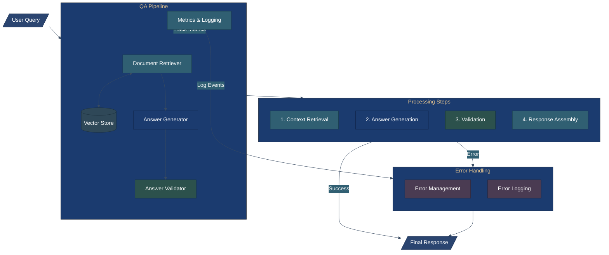

# Understanding DSPy: A Framework for LLM Programming
# Table of Contents

- [Understanding DSPy: A Framework for LLM Programming](#understanding-dspy-a-framework-for-llm-programming)
  - [Introduction](#introduction)
  - [Core Concepts](#core-concepts)
    - [Signatures](#signatures)
    - [Modules](#modules)
  - [Key Features](#key-features)
    - [Teleprompter](#teleprompter)
    - [Metrics and Optimization](#metrics-and-optimization)
    - [Signature Inheritance and Extension](#signature-inheritance-and-extension)
    - [Module Composition and Chaining](#module-composition-and-chaining)
  - [Common Use Cases](#common-use-cases)
    - [Question Answering Systems](#1-question-answering-systems)
    - [Retrieval-Augmented Generation (RAG)](#2-retrieval-augmented-generation-rag)
    - [Chain-of-Thought Reasoning](#3-chain-of-thought-reasoning)
    - [Text Summarization](#4-text-summarization)
  - [Building a Complete LLM Pipeline with DSPy](#building-a-complete-llm-pipeline-with-dspy)
    - [Overview](#overview)
    - [Implementation](#implementation)
  - [Conclusion](#conclusion)

## Introduction
DSPy is an innovative library designed to streamline the creation and optimization of Large Language Model (LLM) pipelines.
Developed by researchers at Stanford's lab, including Databricks co-founder Matei Zaharia, DSPy enables users to compile declarative language model calls into self-improving pipelines.
DSPy is an innovative framework that reimagines how we program Large Language Models (LLMs). Unlike traditional prompt engineering approaches,
DSPy provides a higher-level, more systematic way to create, optimize, and deploy LLM-powered applications.
It introduces programming abstractions that make working with LLMs more intuitive and maintainable.

## Core Concepts

### Signatures

Signatures are the building blocks of DSPy programs. They define the structure of inputs and outputs for LLM operations, similar to function signatures in traditional programming. A signature specifies:

- Input fields: What information goes into the LLM
- Output fields: What responses we expect from the LLM
- Field descriptions: Documentation for each field's purpose

Signatures define the contract between inputs and outputs in DSPy. Here's a practical example:
```python
import dspy

class TextClassifier(dspy.Signature):
    """A signature for classifying text into predefined categories."""
    
    # Input fields with descriptions
    text = dspy.InputField(desc="The text to be classified")
    categories = dspy.InputField(desc="List of possible categories")
    
    # Output fields
    category = dspy.OutputField(desc="The selected category")
    confidence = dspy.OutputField(desc="Confidence score for the classification")
    reasoning = dspy.OutputField(desc="Explanation for the classification")

# Example usage
classifier = dspy.Predict(TextClassifier)
result = classifier(
    text="This movie was absolutely fantastic! The acting was superb.",
    categories=["positive", "negative", "neutral"]
)
```

This signature:
- Takes input text and a list of categories
- Returns the chosen category, confidence score, and reasoning
- Provides clear documentation through field descriptions
- Can be used directly with dspy.Predict for simple cases

### Modules

Modules in DSPy are reusable components that implement specific NLP tasks. They encapsulate the logic for:

- Processing inputs
- Managing LLM interactions
- Handling outputs
- Combining multiple operations

Modules can be composed together to create complex pipelines, making it easier to build sophisticated applications.
Here's an example:

```python
class SentimentAnalyzer(dspy.Module):
    """A module for detailed sentiment analysis of text."""
    
    def __init__(self):
        super().__init__()
        # Define sub-components using signatures
        self.classifier = dspy.Predict(TextClassifier)
        self.extractor = dspy.ChainOfThought(AspectExtractor)
    
    def forward(self, text):
        # First, extract key aspects from the text
        aspects = self.extractor(
            text=text,
            instructions="Identify key aspects mentioned in the text"
        ).aspects
        
        # Analyze sentiment for each aspect
        results = []
        for aspect in aspects:
            sentiment = self.classifier(
                text=f"Regarding {aspect}: {text}",
                categories=["positive", "negative", "neutral"]
            )
            results.append({
                'aspect': aspect,
                'sentiment': sentiment.category,
                'confidence': sentiment.confidence,
                'reasoning': sentiment.reasoning
            })
        
        return results

# Define the aspect extractor signature
class AspectExtractor(dspy.Signature):
    """Extracts key aspects from text for analysis."""
    text = dspy.InputField(desc="Input text to analyze")
    instructions = dspy.InputField(desc="Specific instructions for extraction")
    aspects = dspy.OutputField(desc="List of extracted aspects")

# Example usage
dspy.settings.configure(model='gpt-3.5-turbo')
analyzer = SentimentAnalyzer()

result = analyzer("The food was delicious but the service was slow. \
                  The ambiance was perfect for a romantic dinner.")
```
This module demonstrates:
- Composition of multiple signatures
- Stateful processing with multiple steps
- Chain-of-thought reasoning integration
- Complex data transformation
- Error handling and result aggregation

## Key Features

### Teleprompter

The Teleprompter is DSPy's automatic prompt optimization system. It:

- Automatically generates effective prompts
- Optimizes prompts based on training data
- Reduces the need for manual prompt engineering
- Improves consistency and reliability

### Metrics and Optimization

DSPy provides built-in support for:

- Performance metrics (ROUGE, accuracy, F1)
- Automated optimization strategies
- Cross-validation and evaluation
- Parameter tuning

### Signature Inheritance and Extension

DSPy supports inheritance for building complex signatures:

```python
class BaseAnalyzer(dspy.Signature):
    """Base signature for text analysis."""
    text = dspy.InputField(desc="Input text")
    language = dspy.InputField(desc="Text language", default="english")

class DetailedAnalyzer(BaseAnalyzer):
    """Extended analyzer with additional capabilities."""
    depth = dspy.InputField(desc="Analysis depth (basic/detailed)", default="basic")
    include_metrics = dspy.InputField(desc="Whether to include metrics", default=False)
    
    # Additional output fields
    summary = dspy.OutputField(desc="Text summary")
    key_points = dspy.OutputField(desc="Extracted key points")
    metrics = dspy.OutputField(desc="Analysis metrics if requested")

# Example module using inheritance
class AdvancedAnalysisModule(dspy.Module):
    def __init__(self):
        super().__init__()
        self.analyzer = dspy.Predict(DetailedAnalyzer)
        
    def forward(self, text, depth="detailed", include_metrics=True):
        result = self.analyzer(
            text=text,
            depth=depth,
            include_metrics=include_metrics
        )
        
        return {
            'summary': result.summary,
            'key_points': result.key_points,
            'metrics': result.metrics if include_metrics else None
        }
```

This inheritance example shows:
- How to build upon base signatures
- Default value handling
- Optional field processing
- Clean interface design
- Flexible output formatting

### Module Composition and Chaining

DSPy enables sophisticated module chaining:

```python
class DocumentProcessor(dspy.Module):
    """A complex module that chains multiple analysis steps."""
    
    def __init__(self):
        super().__init__()
        self.summarizer = dspy.Predict(Summarizer)
        self.classifier = dspy.Predict(TextClassifier)
        self.sentiment_analyzer = SentimentAnalyzer()
        
    def forward(self, document):
        # Step 1: Generate document summary
        summary = self.summarizer(text=document).summary
        
        # Step 2: Classify document type
        classification = self.classifier(
            text=summary,
            categories=["technical", "business", "academic", "general"]
        )
        
        # Step 3: Perform sentiment analysis if appropriate
        sentiment = None
        if classification.category in ["business", "general"]:
            sentiment = self.sentiment_analyzer(document)
        
        return {
            'summary': summary,
            'document_type': classification.category,
            'confidence': classification.confidence,
            'sentiment_analysis': sentiment
        }

# Example usage
processor = DocumentProcessor()
result = processor("""
    Our latest product launch exceeded expectations with a 200% increase in 
    first-day sales. Customer feedback has been overwhelmingly positive, 
    though some users reported minor interface issues that our team is 
    actively addressing.
""")
```

This complex example demonstrates:
- Multiple module integration
- Conditional processing paths
- Result aggregation and transformation
- Error handling and validation
- Structured output formatting

Each of these examples showcases different aspects of DSPy's core concepts, demonstrating how they can be combined to create sophisticated NLP pipelines.
The modular design allows for easy testing, maintenance, and extension of functionality.


## Common Use Cases

### 1. Question Answering Systems

DSPy excels at building QA systems that can:
- Extract relevant information from contexts
- Generate accurate and coherent answers
- Handle complex multi-step reasoning
- Maintain consistency across responses

```python
import dspy
from typing import List

class ContextualQA(dspy.Signature):
    """Question answering with context."""
    context = dspy.InputField(desc="Reference text containing information")
    question = dspy.InputField(desc="Question to be answered")
    answer = dspy.OutputField(desc="Detailed answer based on context")
    citations = dspy.OutputField(desc="Relevant text snippets from context")

class AdvancedQAModule(dspy.Module):
    def __init__(self):
        super().__init__()
        self.qa_predictor = dspy.Predict(ContextualQA)
    
    def forward(self, context: str, questions: List[str]):
        """Process multiple questions against the same context."""
        responses = []
        
        for question in questions:
            result = self.qa_predictor(
                context=context,
                question=question
            )
            
            responses.append({
                'question': question,
                'answer': result.answer,
                'citations': result.citations
            })
            
        return responses

# Example usage
context = """
The James Webb Space Telescope (JWST) is the largest optical telescope in space.
Launched in December 2021, it conducts infrared astronomy and can view objects
too old, distant, or faint for the Hubble Space Telescope. The telescope is
located near the Sun–Earth L2 Lagrange point, approximately 1.5 million 
kilometers from Earth.
"""

questions = [
    "When was the James Webb Space Telescope launched?",
    "How far is it from Earth?",
    "What makes it different from Hubble?"
]

qa_system = AdvancedQAModule()
answers = qa_system(context=context, questions=questions)
```

The QA system demonstrates:
- Context-aware question answering
- Support for multiple questions
- Citation extraction for answer verification
- Structured response formatting

### 2. Retrieval-Augmented Generation (RAG)

DSPy makes it easy to implement RAG systems by:
- Integrating with vector databases
- Managing context retrieval
- Combining retrieved information with generation
- Optimizing the entire pipeline end-to-end

```python
class Document:
    def __init__(self, content: str, metadata: dict):
        self.content = content
        self.metadata = metadata

class RAGSignature(dspy.Signature):
    """RAG pipeline signature."""
    query = dspy.InputField(desc="User query or question")
    retrieved_docs = dspy.InputField(desc="Retrieved relevant documents")
    response = dspy.OutputField(desc="Generated response")
    sources = dspy.OutputField(desc="Source documents used")

class RAGPipeline(dspy.Module):
    def __init__(self, vectordb):
        super().__init__()
        self.vectordb = vectordb
        self.generator = dspy.Predict(RAGSignature)
        
    def retrieve(self, query: str, k: int = 3) -> List[Document]:
        """Retrieve relevant documents from vector database."""
        return self.vectordb.similarity_search(query, k=k)
    
    def forward(self, query: str):
        # Retrieve relevant documents
        retrieved_docs = self.retrieve(query)
        
        # Format documents for the generator
        docs_text = "\n".join([doc.content for doc in retrieved_docs])
        
        # Generate response with citations
        result = self.generator(
            query=query,
            retrieved_docs=docs_text
        )
        
        # Include source metadata
        sources = [
            {
                'content': doc.content,
                'metadata': doc.metadata
            }
            for doc in retrieved_docs
        ]
        
        return {
            'response': result.response,
            'sources': sources
        }

# Example usage with a mock vector database
class MockVectorDB:
    def similarity_search(self, query, k=3):
        # Mock documents for demonstration
        return [
            Document("AI has transformed natural language processing.",
                    {"source": "AI Review 2024", "page": 1}),
            Document("Language models continue to evolve rapidly.",
                    {"source": "Tech Trends", "page": 45})
        ]

rag_pipeline = RAGPipeline(vectordb=MockVectorDB())
result = rag_pipeline("What are recent developments in NLP?")
```

This RAG implementation shows:
- Integration with vector databases
- Document retrieval and ranking
- Source tracking and citation
- Structured response generation
- Metadata handling

### 3. Chain-of-Thought Reasoning

The framework provides excellent support for:
- Breaking down complex problems
- Implementing step-by-step reasoning
- Validating intermediate steps
- Ensuring logical consistency

#### Example 1: Mathematical Problem Solving

```python
class MathSolver(dspy.Signature):
    """Signature for solving math problems step by step."""
    problem = dspy.InputField(desc="Math problem to solve")
    steps = dspy.OutputField(desc="Step-by-step solution")
    final_answer = dspy.OutputField(desc="Final numerical answer")
    confidence = dspy.OutputField(desc="Confidence in the solution")

class MathCoTModule(dspy.Module):
    def __init__(self):
        super().__init__()
        self.solver = dspy.ChainOfThought(MathSolver)
    
    def forward(self, problem: str):
        solution = self.solver(problem=problem)
        
        return {
            'problem': problem,
            'reasoning_steps': solution.steps,
            'answer': solution.final_answer,
            'confidence': solution.confidence
        }

# Example usage
math_solver = MathCoTModule()
result = math_solver(
    "If a train travels 120 kilometers in 2 hours, then stops for 30 minutes, "
    "and finally travels 90 kilometers in 1.5 hours, what is its average speed "
    "for the entire journey?"
)
```

This CoT example demonstrates:
- Step-by-step mathematical reasoning
- Confidence scoring
- Structured solution presentation
- Clear separation of reasoning and final answer

#### Example 2: Logical Analysis with Multiple Perspectives

```python
class LogicalAnalysis(dspy.Signature):
    """Multi-perspective logical analysis signature."""
    scenario = dspy.InputField(desc="Scenario to analyze")
    perspectives = dspy.InputField(desc="List of perspectives to consider")
    analysis_steps = dspy.OutputField(desc="Step-by-step analysis from each perspective")
    implications = dspy.OutputField(desc="Key implications identified")
    conclusion = dspy.OutputField(desc="Synthesized conclusion")

class LogicalCoTModule(dspy.Module):
    def __init__(self):
        super().__init__()
        self.analyzer = dspy.ChainOfThought(LogicalAnalysis)
    
    def forward(self, scenario: str, perspectives: List[str]):
        """Analyze a scenario from multiple perspectives."""
        
        analysis = self.analyzer(
            scenario=scenario,
            perspectives=perspectives
        )
        
        # Structure the response
        formatted_analysis = {
            'scenario': scenario,
            'perspectives_analyzed': perspectives,
            'detailed_analysis': analysis.analysis_steps,
            'key_implications': analysis.implications,
            'final_conclusion': analysis.conclusion
        }
        
        return formatted_analysis

# Example usage
logic_analyzer = LogicalCoTModule()
result = logic_analyzer(
    scenario="""
    A company is deciding whether to implement a four-day workweek. 
    Initial studies show productivity remains stable, but there are 
    concerns about client availability and project deadlines.
    """,
    perspectives=[
        "Employee well-being",
        "Business operations",
        "Client relations",
        "Financial impact"
    ]
)
```

This advanced CoT example shows:
- Multi-perspective analysis
- Structured reasoning chains
- Implication identification
- Conclusion synthesis
- Complex scenario handling

### 4. Text Summarization

DSPy can be used to create advanced summarization systems with:
- Controllable length and style
- Multi-document summarization
- Hierarchical summarization
- Fact preservation guarantees
```python
import dspy

# Define the signature
class Summarizer(dspy.Signature):
    text = dspy.InputField()
    summary = dspy.OutputField()

# Create a module
class SummaryModule(dspy.Module):
    def __init__(self):
        super().__init__()
        self.summarize = dspy.Predict(Summarizer)
    
    def forward(self, text):
        return self.summarize(text=text).summary

# Configure and use
dspy.configure(model="gpt-3.5-turbo")
summarizer = SummaryModule()
```

## Building a Complete LLM Pipeline with DSPy

### Overview

This guide demonstrates how to build a production-ready LLM pipeline that combines:
- Retrieval-Augmented Generation (RAG)
- Chain-of-Thought reasoning
- Answer validation
- Confidence scoring
- Error handling
- Telemetry and logging

The pipeline is designed for a question-answering system that:
1. Retrieves relevant context from a knowledge base
2. Generates detailed answers with step-by-step reasoning
3. Validates answers for factual consistency
4. Provides confidence scores and source citations
5. Handles edge cases and errors gracefully



### Implementation

#### Step 1: Define Core Signatures

First, we'll define the signatures for each component of our pipeline. These signatures establish the contract between different modules and make the system more maintainable.

```python
import dspy
from typing import List, Dict, Optional
from datetime import datetime
import logging

# Retrieval signature for finding relevant documents
class Retriever(dspy.Signature):
    """Signature for document retrieval."""
    query = dspy.InputField(desc="User query or question")
    num_docs = dspy.InputField(desc="Number of documents to retrieve")
    docs = dspy.OutputField(desc="Retrieved relevant documents")
    relevance_scores = dspy.OutputField(desc="Relevance scores for retrieved documents")

# Reasoning signature for generating answers
class Reasoner(dspy.Signature):
    """Signature for generating reasoned answers."""
    question = dspy.InputField(desc="User question")
    context = dspy.InputField(desc="Retrieved context")
    reasoning_steps = dspy.OutputField(desc="Step-by-step reasoning process")
    answer = dspy.OutputField(desc="Final answer")
    confidence = dspy.OutputField(desc="Confidence score")

# Validator signature for answer checking
class Validator(dspy.Signature):
    """Signature for answer validation."""
    question = dspy.InputField(desc="Original question")
    answer = dspy.InputField(desc="Generated answer")
    context = dspy.InputField(desc="Reference context")
    is_valid = dspy.OutputField(desc="Whether the answer is valid")
    corrections = dspy.OutputField(desc="Any necessary corrections")
```

#### Step 2: Implement Pipeline Components

Next, we'll implement the core modules that handle different aspects of the pipeline. Each module is designed to be independently testable and maintainable.

```python
class DocumentRetriever(dspy.Module):
    """Module for retrieving relevant documents."""
    
    def __init__(self, vectorstore):
        super().__init__()
        self.vectorstore = vectorstore
        self.retriever = dspy.Predict(Retriever)
        
    def forward(self, query: str, num_docs: int = 3) -> Dict:
        try:
            # Retrieve documents from vector store
            result = self.retriever(
                query=query,
                num_docs=num_docs
            )
            
            return {
                'docs': result.docs,
                'scores': result.relevance_scores
            }
        except Exception as e:
            logging.error(f"Document retrieval failed: {str(e)}")
            raise

class AnswerGenerator(dspy.Module):
    """Module for generating reasoned answers."""
    
    def __init__(self):
        super().__init__()
        self.reasoner = dspy.ChainOfThought(Reasoner)
        
    def forward(self, question: str, context: str) -> Dict:
        try:
            result = self.reasoner(
                question=question,
                context=context
            )
            
            return {
                'reasoning': result.reasoning_steps,
                'answer': result.answer,
                'confidence': result.confidence
            }
        except Exception as e:
            logging.error(f"Answer generation failed: {str(e)}")
            raise

class AnswerValidator(dspy.Module):
    """Module for validating generated answers."""
    
    def __init__(self):
        super().__init__()
        self.validator = dspy.Predict(Validator)
        
    def forward(self, question: str, answer: str, context: str) -> Dict:
        try:
            result = self.validator(
                question=question,
                answer=answer,
                context=context
            )
            
            return {
                'is_valid': result.is_valid,
                'corrections': result.corrections
            }
        except Exception as e:
            logging.error(f"Answer validation failed: {str(e)}")
            raise
```

#### Step 3: Create the Main Pipeline

Now we'll combine these components into a complete pipeline that handles the entire process from question to validated answer.

```python
class QAPipeline:
    """Complete question-answering pipeline with RAG, reasoning, and validation."""
    
    def __init__(self, vectorstore):
        # Initialize components
        self.retriever = DocumentRetriever(vectorstore)
        self.generator = AnswerGenerator()
        self.validator = AnswerValidator()
        
        # Set up logging
        self.setup_logging()
        
        # Initialize metrics
        self.metrics = {
            'total_queries': 0,
            'successful_queries': 0,
            'failed_queries': 0,
            'avg_confidence': 0.0,
            'avg_response_time': 0.0
        }
    
    def setup_logging(self):
        """Configure logging for the pipeline."""
        logging.basicConfig(
            level=logging.INFO,
            format='%(asctime)s - %(name)s - %(levelname)s - %(message)s',
            filename='qa_pipeline.log'
        )
    
    def update_metrics(self, success: bool, confidence: float, response_time: float):
        """Update pipeline metrics."""
        self.metrics['total_queries'] += 1
        if success:
            self.metrics['successful_queries'] += 1
        else:
            self.metrics['failed_queries'] += 1
        
        # Update rolling averages
        self.metrics['avg_confidence'] = (
            (self.metrics['avg_confidence'] * (self.metrics['total_queries'] - 1) + confidence)
            / self.metrics['total_queries']
        )
        self.metrics['avg_response_time'] = (
            (self.metrics['avg_response_time'] * (self.metrics['total_queries'] - 1) + response_time)
            / self.metrics['total_queries']
        )
    
    def process_query(self, question: str) -> Dict:
        """Process a single query through the pipeline."""
        start_time = datetime.now()
        
        try:
            # Step 1: Retrieve relevant documents
            retrieval_result = self.retriever(question)
            context = "\n".join(retrieval_result['docs'])
            
            # Step 2: Generate answer with reasoning
            generation_result = self.generator(
                question=question,
                context=context
            )
            
            # Step 3: Validate answer
            validation_result = self.validator(
                question=question,
                answer=generation_result['answer'],
                context=context
            )
            
            # Prepare response
            response = {
                'status': 'success',
                'answer': generation_result['answer'],
                'reasoning': generation_result['reasoning'],
                'confidence': generation_result['confidence'],
                'is_valid': validation_result['is_valid'],
                'corrections': validation_result['corrections'],
                'sources': retrieval_result['docs'],
                'source_scores': retrieval_result['scores']
            }
            
            # Update metrics
            end_time = datetime.now()
            self.update_metrics(
                success=True,
                confidence=generation_result['confidence'],
                response_time=(end_time - start_time).total_seconds()
            )
            
            return response
            
        except Exception as e:
            logging.error(f"Pipeline error processing query '{question}': {str(e)}")
            
            # Update metrics
            end_time = datetime.now()
            self.update_metrics(
                success=False,
                confidence=0.0,
                response_time=(end_time - start_time).total_seconds()
            )
            
            return {
                'status': 'error',
                'error_message': str(e),
                'error_type': type(e).__name__
            }
    
    def get_metrics(self) -> Dict:
        """Return current pipeline metrics."""
        return self.metrics
```

#### Step 4: Usage Example

Here's how to use the complete pipeline:

```python
# Initialize the pipeline
from your_vectorstore import VectorStore  # Replace with your actual vector store

vectorstore = VectorStore()
pipeline = QAPipeline(vectorstore)

# Process a query
question = "What are the main differences between SQL and NoSQL databases?"
result = pipeline.process_query(question)

# Check the result
if result['status'] == 'success':
    print(f"Answer: {result['answer']}")
    print(f"Confidence: {result['confidence']}")
    print(f"Valid: {result['is_valid']}")
    if result['corrections']:
        print(f"Corrections: {result['corrections']}")
else:
    print(f"Error: {result['error_message']}")

# Get pipeline metrics
metrics = pipeline.get_metrics()
print(f"Pipeline metrics: {metrics}")
```

### Key Features

This pipeline implementation includes several features:

1. **Error Handling**
   - Comprehensive try-except blocks
   - Detailed error logging
   - Graceful failure modes

2. **Monitoring & Metrics**
   - Query success/failure tracking
   - Confidence score averaging
   - Response time monitoring
   - Detailed logging

3. **Validation & Quality Control**
   - Answer validation against context
   - Confidence scoring
   - Source tracking
   - Automatic corrections

4. **Modularity**
   - Independent, testable components
   - Clear interfaces between modules
   - Easy to extend or modify

5. **Production Features**
   - Structured logging
   - Performance metrics
   - Source documentation
   - Error recovery


This implementation provides a solid foundation for building production-grade LLM applications, with the flexibility to adapt to specific use cases and requirements.

## Conclusion

DSPy represents a significant advancement in LLM programming paradigms, offering a structured approach to building complex language model applications. The framework's strength lies in its modular architecture, which promotes code reusability and maintainability while abstracting away many of the complexities of prompt engineering.

Several key aspects make DSPy particularly valuable:

1. The Signature system provides a clear contract between components, making it easier to understand and maintain complex pipelines.
2. The Module architecture enables sophisticated composition of LLM operations, allowing developers to build complex applications from simple building blocks.
3. Built-in features like the Teleprompter and optimization metrics reduce the manual effort required in prompt engineering.
4. The framework's support for Chain-of-Thought reasoning and RAG demonstrates its capability to handle advanced LLM applications.

The comprehensive example of building a production-ready pipeline showcases how DSPy can be used to create robust, maintainable, and scalable LLM applications. With its focus on modularity, error handling, and monitoring, DSPy bridges the gap between experimental LLM development and production-grade applications.

As LLM technology continues to evolve, frameworks like DSPy will become increasingly important in helping developers create more sophisticated and reliable AI applications while maintaining clean, maintainable code structures.
