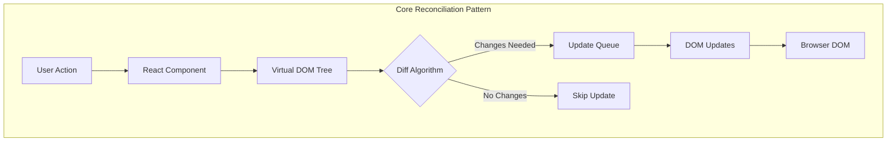
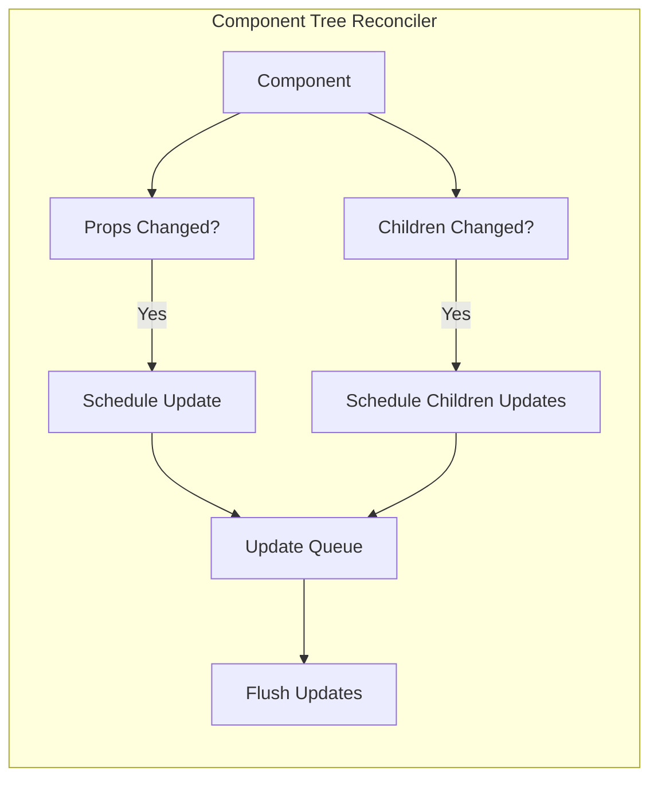
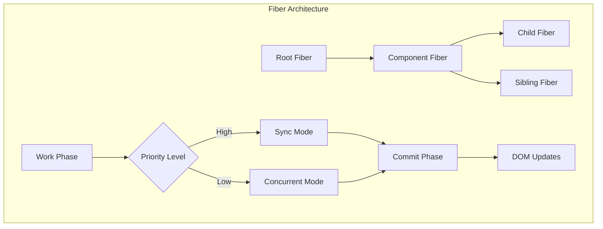
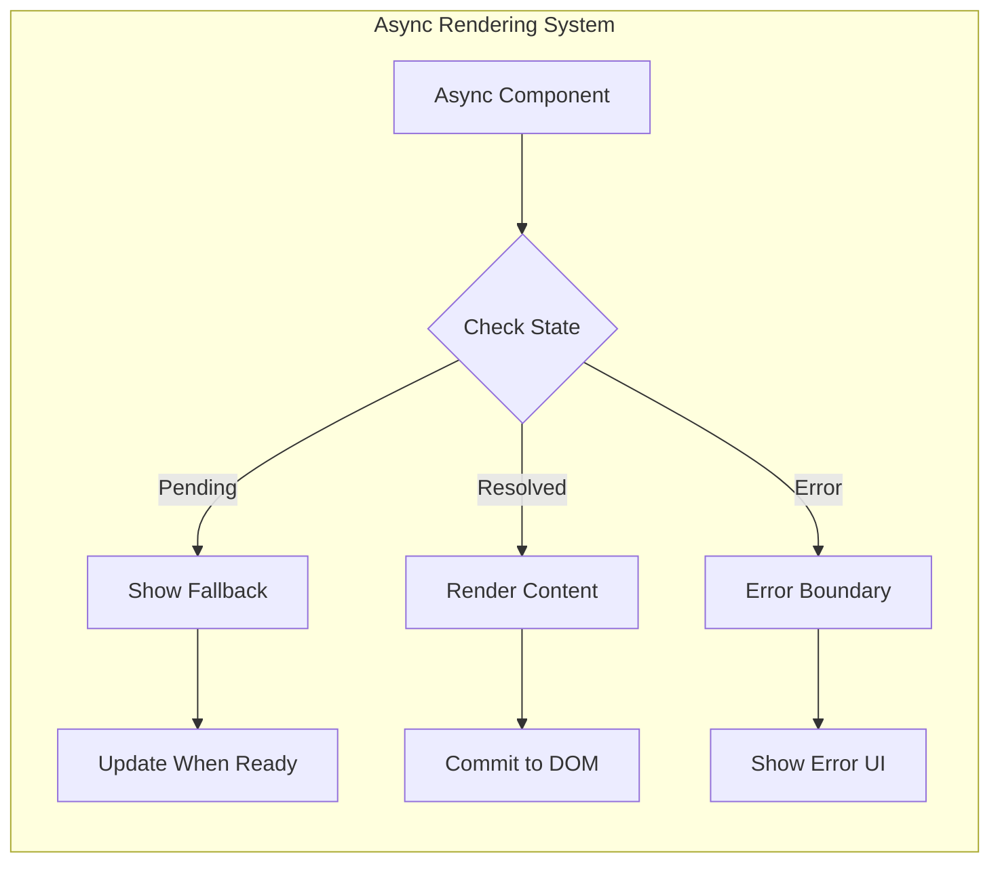
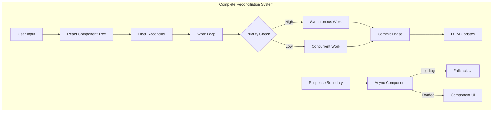

# Understanding React's Reconciliation Pattern in TypeScript

## Table of Contents
1. [Introduction](#introduction)
2. [Core Reconciliation Pattern](#core-reconciliation-pattern)
   - [Basic Concepts](#basic-concepts)
   - [Real-World Example: Component Tree](#real-world-example-component-tree)
3. [Advanced Reconciliation](#advanced-reconciliation)
   - [Fiber Architecture](#fiber-architecture)
   - [Example: Async Rendering](#example-async-rendering)
4. [Recommended Practices](#recommended-practices)
5. [Conclusion](#conclusion)

## Introduction

React's reconciliation pattern is a sophisticated approach to maintaining UI state, similar to how Kubernetes controllers maintain cluster state. While Kubernetes reconciles actual cluster state with desired specifications, React reconciles the actual DOM with a virtual DOM representation.

Think of reconciliation as an efficient UI manager:
- It maintains a virtual representation of the UI (Virtual DOM)
- It compares desired changes against current state
- It calculates and applies minimal updates needed

## Core Reconciliation Pattern

### Basic Concepts

The pattern consists of three key elements:
1. **Virtual DOM**: Lightweight JavaScript representation of desired UI state
2. **Actual DOM**: Current browser DOM state
3. **Reconciliation Process**: Algorithm to align actual DOM with Virtual DOM

Here's a simple implementation:

```typescript
interface VirtualNode {
  type: string;
  props: {
    children?: VirtualNode[];
    [key: string]: any;
  };
}

class SimpleReconciler {
  private currentTree: VirtualNode | null = null;
  private domElement: HTMLElement;

  constructor(container: HTMLElement) {
    this.domElement = container;
  }

  reconcile(newTree: VirtualNode): void {
    if (!this.currentTree) {
      // Initial render
      this.mountTree(newTree);
    } else {
      // Update existing tree
      this.updateTree(this.currentTree, newTree);
    }
    this.currentTree = newTree;
  }

  private mountTree(node: VirtualNode): HTMLElement {
    const element = document.createElement(node.type);
    
    // Apply props
    Object.entries(node.props).forEach(([key, value]) => {
      if (key !== 'children') {
        element.setAttribute(key, value);
      }
    });

    // Mount children
    if (node.props.children) {
      node.props.children.forEach(child => {
        element.appendChild(this.mountTree(child));
      });
    }

    return element;
  }

  private updateTree(oldNode: VirtualNode, newNode: VirtualNode): void {
    if (oldNode.type !== newNode.type) {
      // Replace entire subtree if types differ
      const newElement = this.mountTree(newNode);
      this.domElement.replaceWith(newElement);
      return;
    }

    // Update props
    this.updateProps(oldNode.props, newNode.props);

    // Reconcile children
    this.reconcileChildren(
      oldNode.props.children || [],
      newNode.props.children || []
    );
  }

  private updateProps(oldProps: any, newProps: any): void {
    const element = this.domElement;
    
    // Remove old props
    Object.keys(oldProps).forEach(key => {
      if (key !== 'children' && !(key in newProps)) {
        element.removeAttribute(key);
      }
    });

    // Set new props
    Object.keys(newProps).forEach(key => {
      if (key !== 'children' && oldProps[key] !== newProps[key]) {
        element.setAttribute(key, newProps[key]);
      }
    });
  }

  private reconcileChildren(
    oldChildren: VirtualNode[],
    newChildren: VirtualNode[]
  ): void {
    // Simple reconciliation - replace all children
    // Real React uses keys and sophisticated diffing
    const container = this.domElement;
    container.innerHTML = '';
    newChildren.forEach(child => {
      container.appendChild(this.mountTree(child));
    });
  }
}
```

### Real-World Example: Component Tree

Let's implement a more practical example with a component tree:

```typescript
interface Component {
  type: 'component';
  name: string;
  state: any;
  props: Record<string, any>;
  children: Component[];
}

class ComponentReconciler {
  private tree: Component | null = null;
  private updates: Set<Component> = new Set();

  reconcile(component: Component): void {
    if (!this.tree) {
      this.tree = component;
      this.performFullRender(component);
      return;
    }

    this.diffComponent(this.tree, component);
    this.flushUpdates();
  }

  private diffComponent(old: Component, next: Component): void {
    if (old.name !== next.name) {
      this.scheduleFullUpdate(next);
      return;
    }

    if (this.hasPropsChanged(old.props, next.props)) {
      this.scheduleUpdate(next);
    }

    // Recursively diff children
    const maxLength = Math.max(
      old.children.length,
      next.children.length
    );

    for (let i = 0; i < maxLength; i++) {
      const oldChild = old.children[i];
      const nextChild = next.children[i];

      if (!oldChild) {
        this.scheduleMount(nextChild);
      } else if (!nextChild) {
        this.scheduleUnmount(oldChild);
      } else {
        this.diffComponent(oldChild, nextChild);
      }
    }
  }

  private hasPropsChanged(
    oldProps: Record<string, any>,
    newProps: Record<string, any>
  ): boolean {
    const allKeys = new Set([
      ...Object.keys(oldProps),
      ...Object.keys(newProps)
    ]);

    for (const key of allKeys) {
      if (oldProps[key] !== newProps[key]) {
        return true;
      }
    }
    return false;
  }

  private scheduleUpdate(component: Component): void {
    this.updates.add(component);
    console.log(`📝 Scheduled update for ${component.name}`);
  }

  private scheduleMount(component: Component): void {
    console.log(`⬆️ Mounting new component: ${component.name}`);
  }

  private scheduleUnmount(component: Component): void {
    console.log(`⬇️ Unmounting component: ${component.name}`);
  }

  private scheduleFullUpdate(component: Component): void {
    console.log(`🔄 Full update needed for ${component.name}`);
  }

  private flushUpdates(): void {
    console.log(`\n🚀 Flushing ${this.updates.size} updates...`);
    this.updates.clear();
  }
}
```

## Advanced Reconciliation

### Fiber Architecture

React's Fiber architecture extends the basic reconciliation pattern with sophisticated scheduling:

```typescript
interface FiberNode {
  type: string;
  key: string | null;
  props: any;
  child: FiberNode | null;
  sibling: FiberNode | null;
  return: FiberNode | null;
  alternate: FiberNode | null;
  effectTag: 'PLACEMENT' | 'UPDATE' | 'DELETION' | null;
}

class FiberReconciler {
  private workInProgress: FiberNode | null = null;
  private currentRoot: FiberNode | null = null;
  
  beginWork(fiber: FiberNode): FiberNode | null {
    console.log(`🔍 Beginning work on ${fiber.type}`);
    
    // Compare with current tree
    const current = fiber.alternate;
    if (current) {
      // Update
      return this.reconcileChildren(fiber, current);
    } else {
      // Mount
      return this.mountFiber(fiber);
    }
  }

  private reconcileChildren(
    wipFiber: FiberNode,
    current: FiberNode
  ): FiberNode | null {
    if (wipFiber.type !== current.type) {
      wipFiber.effectTag = 'PLACEMENT';
      return null;
    }

    if (this.shouldUpdate(wipFiber.props, current.props)) {
      wipFiber.effectTag = 'UPDATE';
    }

    return wipFiber.child;
  }

  private mountFiber(fiber: FiberNode): FiberNode | null {
    fiber.effectTag = 'PLACEMENT';
    return fiber.child;
  }

  private shouldUpdate(newProps: any, oldProps: any): boolean {
    // Simplified prop comparison
    return JSON.stringify(newProps) !== JSON.stringify(oldProps);
  }

  commitWork(fiber: FiberNode): void {
    if (!fiber.effectTag) return;

    console.log(`📝 Committing ${fiber.effectTag} for ${fiber.type}`);
    
    switch (fiber.effectTag) {
      case 'PLACEMENT':
        this.commitPlacement(fiber);
        break;
      case 'UPDATE':
        this.commitUpdate(fiber);
        break;
      case 'DELETION':
        this.commitDeletion(fiber);
        break;
    }
  }

  private commitPlacement(fiber: FiberNode): void {
    console.log(`⬆️ Placing new node: ${fiber.type}`);
  }

  private commitUpdate(fiber: FiberNode): void {
    console.log(`🔄 Updating node: ${fiber.type}`);
  }

  private commitDeletion(fiber: FiberNode): void {
    console.log(`⬇️ Removing node: ${fiber.type}`);
  }
}
```

### Example: Async Rendering

Here's how React handles async rendering with reconciliation:

```typescript
interface AsyncComponent {
  type: string;
  props: any;
  state: 'pending' | 'resolved' | 'error';
  result?: any;
  error?: Error;
}

class AsyncReconciler {
  private pendingWork: Map<string, AsyncComponent> = new Map();
  
  reconcileAsync(component: AsyncComponent): void {
    switch (component.state) {
      case 'pending':
        this.handlePending(component);
        break;
      case 'resolved':
        this.handleResolved(component);
        break;
      case 'error':
        this.handleError(component);
        break;
    }
  }

  private handlePending(component: AsyncComponent): void {
    console.log(`⏳ Suspending render for ${component.type}`);
    this.pendingWork.set(component.type, component);
    
    // Show fallback UI
    this.showFallback(component);
  }

  private handleResolved(component: AsyncComponent): void {
    console.log(`✅ Rendering resolved component: ${component.type}`);
    this.pendingWork.delete(component.type);
    
    // Render actual component
    this.renderComponent(component);
  }

  private handleError(component: AsyncComponent): void {
    console.log(`❌ Handling error in ${component.type}`);
    this.pendingWork.delete(component.type);
    
    // Show error boundary
    this.showErrorBoundary(component);
  }

  private showFallback(component: AsyncComponent): void {
    console.log(`🔄 Showing fallback for ${component.type}`);
  }

  private renderComponent(component: AsyncComponent): void {
    console.log(`🎨 Rendering ${component.type}`);
  }

  private showErrorBoundary(component: AsyncComponent): void {
    console.log(`🚫 Showing error boundary for ${component.type}`);
  }
}
```

## Recommended Practices

1. **Key Management**
   - Always use stable, unique keys for list items
   - Avoid using index as keys when order might change

2. **Component Structure**
   - Keep components small and focused
   - Use React.memo() for expensive computations

3. **State Updates**
   - Batch related state updates
   - Use functional updates for state that depends on previous value

4. **Performance Optimization**
   - Implement shouldComponentUpdate or use React.memo wisely
   - Avoid unnecessary re-renders through proper component structure

## Conclusion

React's reconciliation pattern demonstrates sophisticated state management through:
1. Virtual DOM representation
2. Efficient diffing algorithms
3. Batched updates
4. Async rendering capabilities

Key benefits:
- Predictable UI updates
- Optimal performance through batching
- Graceful handling of async operations
- Minimal DOM manipulation

The pattern's success lies in its ability to:
- Handle complex UI state changes efficiently
- Provide developer-friendly abstractions
- Maintain performance at scale
- Enable advanced features like Suspense and Concurrent Mode

As web applications grow more complex, understanding and properly implementing these patterns becomes crucial for maintaining performant and maintainable applications.
